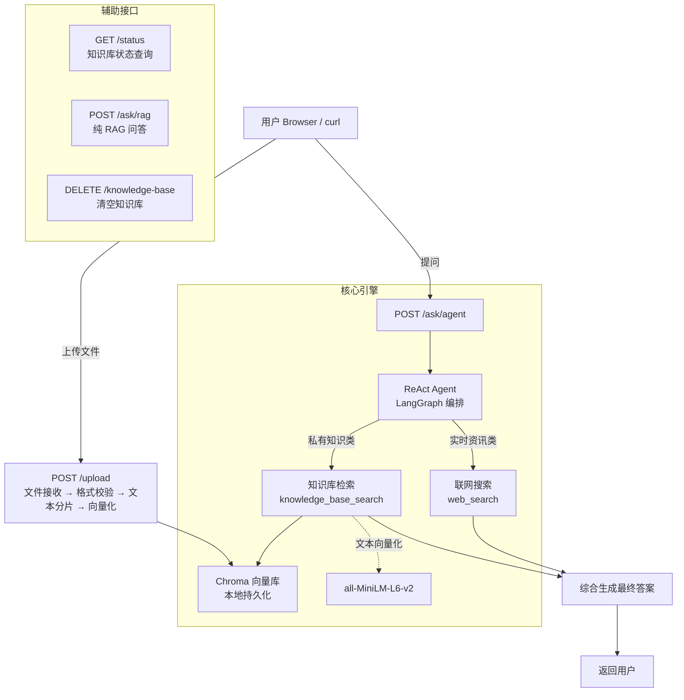
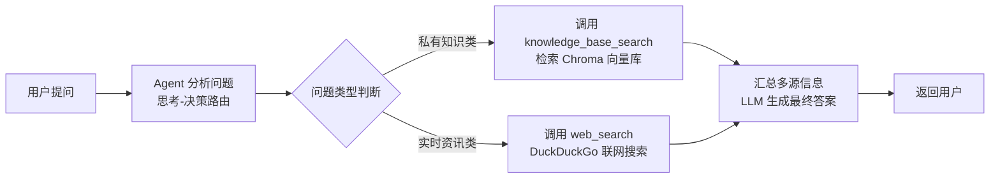
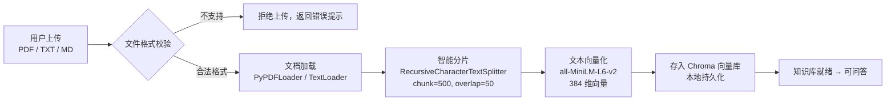

# 个人知识库智能助手

基于 **FastAPI + LangChain + RAG + ReAct Agent** 构建的轻量化智能问答系统。支持上传本地文档（PDF / TXT / MD）构建私有知识库，结合联网搜索实现双模式智能问答。

## 一、项目结构

```
个人助手/
├── config.py           # 配置中心（LLM、Embedding、分块参数）
├── document_loader.py  # PDF/TXT/MD 加载 + 文本智能分片
├── vector_store.py     # Chroma 向量库操作（增/查/清/统计）
├── rag_chain.py        # RAG 检索增强生成链路
├── agent.py            # ReAct Agent 工厂（知识库 + 联网搜索双工具）
├── tools.py            # 工具定义（knowledge_base_search / web_search）
├── main.py             # FastAPI 接口服务（5 个接口）
├── .env                # API Key / 模型配置
└── requirements.txt    # 依赖清单
```

## 二、技术栈

| 层次 | 技术 | 说明 |
|------|------|------|
| 接口层 | FastAPI + Uvicorn | 高性能异步 Web 服务，Swagger 自动文档 |
| AI 框架 | LangChain + LangGraph | Chain 编排、Agent 工具调用、会话记忆 |
| 知识库 | Chroma 向量数据库 | 本地轻量化，零部署依赖 |
| 文档解析 | PyPDF + TextLoader | 支持 PDF / TXT / MD 格式 |
| LLM | deepseek-chat | 兼容 OpenAI 接口，低成本高性价比 |
| Embedding | all-MiniLM-L6-v2 | 384 维本地向量模型，无需调用外部 API |

## 三、系统架构



## 四、核心业务流程



## 五、文件处理流程



## 六、API 接口

### 文件上传
```bash
curl -X POST http://localhost:8001/upload \
  -F "files=@笔记.pdf" \
  -F "files=@文档.txt"
```

### RAG 问答（仅本地知识库）
```bash
curl -X POST http://localhost:8001/ask/rag \
  -H "Content-Type: application/json" \
  -d '{"question": "什么是RAG？"}'
```

### Agent 智能问答（知识库 + 联网搜索）
```bash
curl -X POST http://localhost:8001/ask/agent \
  -H "Content-Type: application/json" \
  -d '{"question": "LangChain 最新版本有哪些新特性？"}'
```

### 知识库管理
```bash
curl http://localhost:8001/status           # 查询状态
curl -X DELETE http://localhost:8001/knowledge-base  # 清空知识库
```

## 七、快速开始

```bash
# 1. 安装依赖
pip install -r requirements.txt

# 2. 配置 .env（已预填 LLM_API_KEY、LLM_MODEL_ID 等）

# 3. 启动服务
python main.py

# 4. 打开接口文档
# http://localhost:8001/docs
```

## 八、项目亮点

- **双模式智能问答**：私有知识库 + 联网搜索自适应切换，解决 RAG 时效性不足问题
- **整条 ReAct Agent 链路**：思考 → 决策 → 工具调用 → 综合输出，标准工业级流程
- **轻量化部署**：Chroma 本地向量库 + 本地 Embedding 模型，零外部服务依赖
- **增量知识库**：支持多次上传文档，持续扩充而不丢失已有数据
- **工程化分层**：config / loader / vector_store / rag / agent / api 六层解耦
- **Swagger 自动文档**：FastAPI 原生的交互式 API 调试页面
