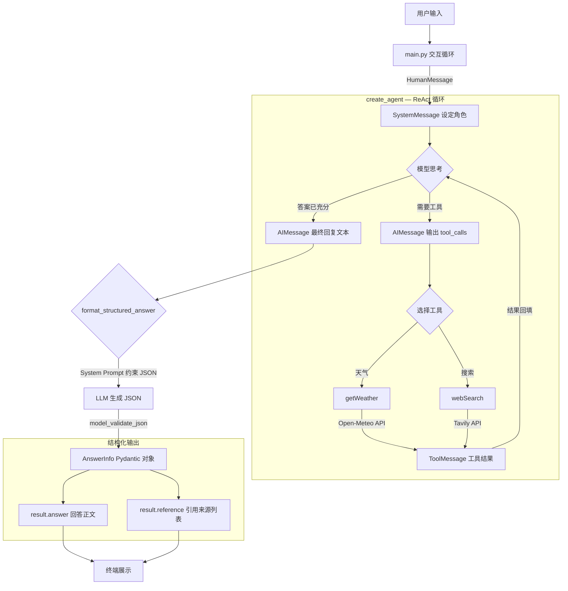

# 智能天气助手

LangChain Agent 实战项目，基于 DeepSeek 模型的智能天气助手，支持天气查询和网页搜索。

## 功能

| 工具 | 说明 |
|------|------|
| `getWeather` | 调用 Open-Meteo 免费 API，查询城市实时天气（温度、风速、天气状况） |
| `webSearch` | 调用 Tavily 搜索引擎，检索互联网实时信息 |

## 项目结构

```
智能天气助手/
├── .env           # 环境变量（API Key），不提交 Git
├── config.py      # 配置管理，统一加载 .env
├── schemas.py     # Pydantic 实体（Reference / AnswerInfo）
├── tools.py       # 工具定义（getWeather / webSearch）
├── agent.py       # Agent 创建 + 结构化输出
├── main.py        # 交互式入口
└── README.md      # 本文件
```

## 流程架构



### 两阶段说明

| 阶段 | 组件 | 输出 |
|------|------|------|
| **Agent 阶段** | `create_agent(llm, tools)` | ReAct 循环 → 自由文本（含工具调用中间过程） |
| **结构化阶段** | `format_structured_answer()` | Prompt 约束 JSON → AnswerInfo 对象（answer + reference） |

### 数据流

```
config.py ──加载──▶ .env ──提供──▶ MODEL_NAME / OPENAI_API_KEY / TAVILY_API_KEY
                                       │
tools.py ──@tool 注册──▶ getWeather / webSearch
                                       │
agent.py ◀── init_chat_model(MODEL_NAME)
    │                                    │
    ├─ create_agent(llm, tools)          │ 注册工具
    │       │
    │       └─ Agent.invoke(messages) ──▶ ReAct 循环 ──▶ 自由文本
    │
    └─ format_structured_answer() ◀── 工具结果文本
            │
            └─ LLM 生成 JSON ──▶ AnswerInfo.model_validate_json() ──▶ Pydantic 对象
```

## 快速开始

### 1. 安装依赖

```bash
pip install langchain langchain-openai python-dotenv requests
```

### 2. 配置 .env

```bash
OPENAI_API_KEY=sk-your-key
OPENAI_BASE_URL=https://api.deepseek.com/v1
MODEL_NAME=openai:deepseek-v4-pro
TAVILY_API_KEY=tvly-your-key
```

### 3. 运行

```bash
python main.py
```

输入 `quit` / `exit` / `q` 退出。

## 相关链接

- [LangChain 快速入门](../LangChain快速入门.md)
- [HelloAgents 源码](../../HelloAgents-learn_version/)
