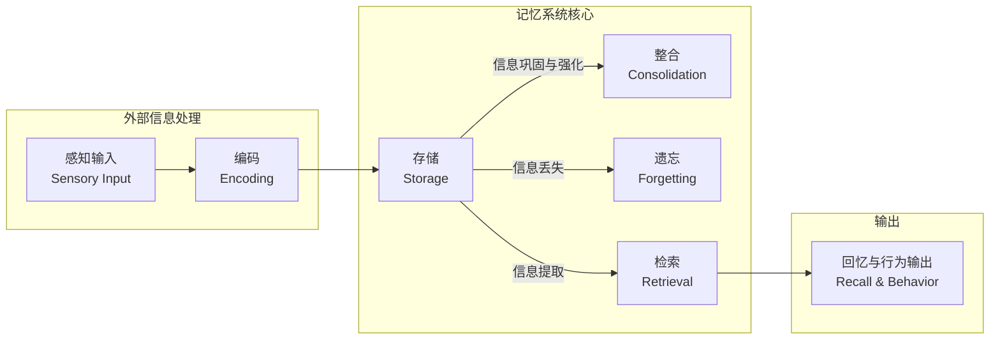
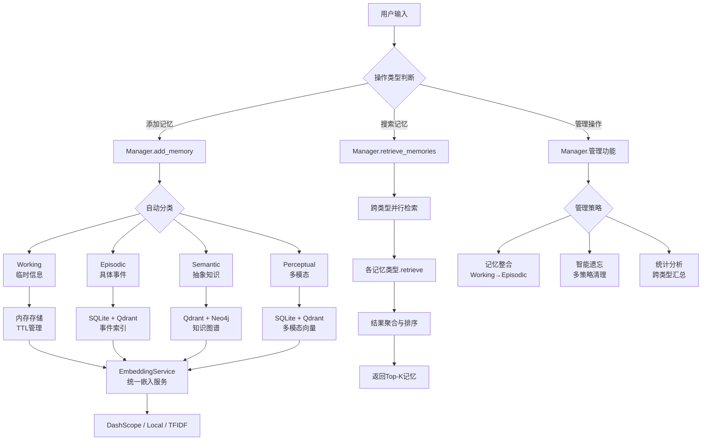
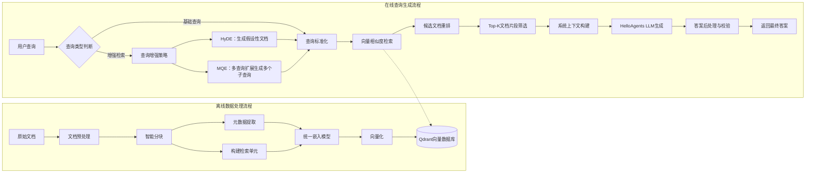

# 8.1.1 人类记忆系统的启发
构建智能体记忆系统前，我们可以从认知科学中人类记忆机制获取设计灵感。人类记忆是一套多层次认知系统，可按照信息时效、重要性与上下文完成信息分类、组织与检索。认知心理学形成了成熟的经典理论框架，用以解释记忆的结构与运行过程，如图8.1。

## 图8.1 人类记忆系统的层次结构
认知心理学将人类记忆划分为三个层级：
1. **感觉记忆（Sensory Memory）**
持续时间仅有0.5–3秒，容量巨大，负责短暂存放感官接收的原始信息，未被关注的信息会迅速丢失。
2. **工作记忆（Working Memory）**
持续时长15–30秒，容量有限（7±2个信息单元），承担当前任务中的实时信息运算与处理，是人思考过程的临时缓存。
3. **长期记忆（Long-term Memory）**
存储时效可达终身，容量几乎不受限制，包含两大分支：
- **程序性记忆**：技能、行为习惯类记忆（例如骑自行车）；
- **陈述性记忆**：可用语言描述的显性知识，进一步划分：
    - 语义记忆：通用概念、客观常识（如“巴黎是法国的首都”）；
    - 情景记忆：个体亲身经历的事件（如“昨天会议的讨论内容”）。

如果你需要，我可以紧接着补充一小段**过渡段落**：连接人类记忆 → LLM智能体记忆系统，承接下文，贴合书本行文逻辑。
# 8.1.2 为何智能体需要记忆与RAG
人类智能的核心特质之一，是能够留存过往经历、沉淀经验规律，并依托已有认知应对全新场景、持续迭代优化自身能力。基于大语言模型（LLM）构建的AI智能体，想要实现真正的智能化、拟人化交互与自主决策，就必须复刻类似的记忆与知识复用能力。

当前主流LLM驱动的智能体，天然存在两大核心局限性，分别对应对话记忆缺失与内置知识受限两大问题，而记忆系统与RAG技术，正是破解这两大痛点的核心解决方案。

## （1）局限一：无状态架构导致的对话遗忘问题
大语言模型的底层设计遵循无状态（Stateless）架构，这是其对话遗忘问题的本质根源。模型的每一次用户请求、每一次API调用，都是一次独立、隔离的计算任务，模型本身不会自动存储、留存任意一轮的对话上下文与交互状态，不会主动记忆用户的历史行为与信息，所有推理输出仅依赖当前输入的提示内容。

这种无状态特性虽然保障了模型推理的通用性、可扩展性与稳定性，但也直接导致智能体存在四大核心缺陷，严重影响交互体验与智能性：
- 上下文信息丢失：受限于模型上下文窗口大小，长对话场景中，早期的关键交互信息会被逐步淘汰遗忘，无法实现全程上下文连贯
- 个性化能力缺失：智能体无法长期留存用户的个人信息、使用偏好、学习进度、专属需求等个性化数据，无法提供定制化服务
- 自主学习受限：无法沉淀过往交互中的成功经验与失败教训，不具备持续迭代、自我优化的学习能力
- 回答一致性差：多轮对话、跨会话交互中，容易出现前后观点矛盾、信息不统一的问题

结合第七章的智能体使用案例，可直观体现该问题：
```python
# 第七章的Agent基础使用方式
from hello_agents import SimpleAgent, HelloAgentsLLM

# 初始化智能体实例
agent = SimpleAgent(name="学习助手", llm=HelloAgentsLLM())

# 第一次对话：用户告知个人学习情况
response1 = agent.run("我叫张三，正在学习Python，目前掌握了基础语法")
print(response1)  # 输出：很好！Python基础语法是编程的重要基础...
 
# 重启会话、重新创建Agent实例（全新会话）
agent = SimpleAgent(name="学习助手", llm=HelloAgentsLLM())
# 第二次对话：询问历史学习进度
response2 = agent.run("你还记得我的学习进度吗？")
print(response2)  # 输出：抱歉，我不知道您的学习进度...
```

需要特别说明的是，第七章介绍的`SimpleAgent`仅支持同进程、同实例的临时上下文留存，通过实例内部的`_history`变量暂存单轮会话的对话记录，能够保障单次连续对话的上下文连贯。但这种存储方式属于临时缓存，**无法跨会话、跨进程持久化留存**，也不支持长期记忆的检索、整合、更新与遗忘机制，无法满足智能体长期、持续、个性化交互的核心需求。而记忆系统的引入，正是为了从根本上解决LLM无状态带来的对话遗忘问题。

## （2）局限二：模型内置知识的固有短板
除了对话记忆缺失的问题，LLM的另一大核心局限是内置知识静态化、有限化。模型的所有知识均来源于训练数据集，一旦训练完成，其内置知识就会固定固化，无法自主更新、拓展，由此衍生出一系列应用痛点，具体如下：
- 知识存在时效性壁垒：模型训练数据存在明确的时间截止点，无法获取截止时间之后的全新信息，难以适配实时性、时效性较强的业务场景
- 领域专业深度不足：通用大模型的知识覆盖面广，但细分垂直领域的专业知识、行业细则、私有业务知识储备不足，无法满足专业化场景需求
- 存在事实幻觉问题：模型容易生成看似合理、实则错误的虚假信息，输出内容的准确性、可靠性无法保障
- 回答可解释性弱：模型原生输出无法提供信息来源，内容可信度难以验证，不利于合规场景与专业场景落地

为彻底破解LLM内置知识的固有缺陷，行业引入了RAG检索增强生成技术。其核心原理是打破模型知识固化的限制，在模型生成回答前，先从外部知识库（文档、数据库、业务API、私有素材库等）中精准检索与用户问题高度相关的权威信息，将检索结果作为补充上下文注入模型，辅助模型生成准确、实时、专业、可溯源的回答，从根源上解决知识滞后、专业性不足、幻觉频发等问题。

如果你想要，我可以再帮你精简一版，或者增加一段总结：**智能体记忆系统 VS RAG 的分工区别**。

# 8.1.3 HelloAgents记忆系统与RAG系统整体架构
记忆系统负责管理智能体自身交互历史、用户偏好与习得经验，整体采用四层分层架构设计：
```
HelloAgents记忆系统
├── 基础设施层 (Infrastructure Layer)
│   ├── MemoryManager - 记忆管理器（统一调度和协调）
│   ├── MemoryItem - 记忆数据结构（标准化记忆项）
│   ├── MemoryConfig - 配置管理（系统参数设置）
│   └── BaseMemory - 记忆基类（通用接口定义）
├── 记忆类型层 (Memory Types Layer)
│   ├── WorkingMemory - 工作记忆（临时信息，TTL生命周期管理）
│   ├── EpisodicMemory - 情景记忆（历史事件，基于时间序列存储）
│   ├── SemanticMemory - 语义记忆（抽象知识，支持图谱关系检索）
│   └── PerceptualMemory - 感知记忆（多模态原始输入数据）
├── 存储后端层 (Storage Backend Layer)
│   ├── QdrantVectorStore - 向量存储（高性能语义相似度检索）
│   ├── Neo4jGraphStore - 图存储（知识图谱实体与关系管理）
│   └── SQLiteDocumentStore - 文档存储（结构化信息持久化）
└── 嵌入服务层 (Embedding Service Layer)
    ├── DashScopeEmbedding - 通义千问嵌入（云端API方案）
    ├── LocalTransformerEmbedding - 本地嵌入（离线私有化部署）
    └── TFIDFEmbedding - TFIDF嵌入（轻量级兜底检索方案）
```

RAG系统聚焦外部私有文档、行业知识库的获取与调用，用于弥补大模型内置知识短板，和记忆系统相互独立、协同工作：
```
HelloAgents RAG系统
├── 文档处理层 (Document Processing Layer)
│   ├── DocumentProcessor - 文档处理器（多格式文档解析）
│   ├── Document - 文档对象（文档元数据管理）
│   └── Pipeline - RAG管道（端到端文档处理链路）
├── 嵌入表示层 (Embedding Layer)
│   └── 统一嵌入接口 —— 直接复用记忆系统内置嵌入服务
├── 向量存储层 (Vector Storage Layer)
│   └── QdrantVectorStore - 向量数据库（通过命名空间实现数据隔离）
└── 智能问答层 (Intelligent Q&A Layer)
    ├── 多策略检索 - 向量检索 + MQE + HyDE混合检索
    ├── 上下文构建 - 智能片段合并、过滤与长度截断
    └── LLM增强生成 - 依托检索上下文生成精准回答
```

> **核心区分小结**
> - **记忆系统**：保存智能体和用户过往交互产生的信息（用户偏好、历史任务、对话经历）；
> - **RAG系统**：读取外部静态文档知识库（手册、业务资料、私有文档）。

## 8.1.4 本章学习目标与快速体验
本章将围绕记忆模块、RAG模块完成原理学习与代码实操，先梳理本章代码目录结构：
```
hello-agents/
├── hello_agents/
│   ├── memory/                   # 记忆系统核心模块
│   │   ├── base.py               # 基础数据结构（MemoryItem, MemoryConfig, BaseMemory）
│   │   ├── manager.py            # 记忆管理器，统一协调各类记忆
│   │   ├── embedding.py          # 统一嵌入服务（DashScope/Local/TFIDF）
│   │   ├── types/                # 四类记忆具体实现
│   │   │   ├── working.py        # 工作记忆（纯内存、TTL自动过期）
│   │   │   ├── episodic.py       # 情景记忆（事件序列，SQLite+Qdrant）
│   │   │   ├── semantic.py       # 语义记忆（知识图谱，Qdrant+Neo4j）
│   │   │   └── perceptual.py     # 感知记忆（多模态数据，SQLite+Qdrant）
│   │   ├── storage/              # 存储后端实现
│   │   │   ├── qdrant_store.py   # Qdrant向量存储（高性能向量检索）
│   │   │   ├── neo4j_store.py    # Neo4j图存储（知识图谱管理）
│   │   │   └── document_store.py # SQLite文档存储（结构化持久化）
│   │   └── rag/                  # RAG检索增强系统
│   │       ├── pipeline.py       # RAG端到端处理管道
│   │       └── document.py       # 文档解析处理器（支持多格式）
│   └── tools/builtin/            # Agent内置扩展工具
│       ├── memory_tool.py        # 记忆工具，为智能体赋予记忆读写能力
│       └── rag_tool.py           # RAG工具，提供知识库检索问答能力
```

如果你想要，我可以再加一小段过渡文字：**记忆系统和RAG如何在智能体运行流程中配合工作**，直接衔接下一节正文。

# 快速开始：安装 HelloAgents 框架
为方便读者快速体验本章完整功能，项目提供可直接安装的 Python 软件包，执行下述命令安装本章配套版本。
> 注意：0.2.0 版本若出现模型调用异常，可参考 issue#320，或切换至 0.2.9 版本进行测试。
```bash
pip install "hello-agents[all]==0.2.0"
# 下载中英文分词模型
python -m spacy download zh_core_web_sm
python -m spacy download en_core_web_sm
```

安装完成后，需要在项目根目录新建 `.env` 文件，完成图数据库、向量数据库、大模型与嵌入服务的参数配置。教程默认选用 Qdrant 作为向量数据库、Neo4j 作为图数据库；嵌入服务优先推荐阿里云百炼平台，若无可用 API Key，可切换成本地部署方案。

```env
# ================================
# Qdrant 向量数据库配置
# 云服务申请地址：https://cloud.qdrant.io/
# ================================
# 方案1：Qdrant 云服务（推荐）
QDRANT_URL=https://your-cluster.qdrant.tech:6333
QDRANT_API_KEY=your_qdrant_api_key_here

# 方案2：本地部署 Qdrant（依赖Docker，放开注释使用）
# QDRANT_URL=http://localhost:6333
# QDRANT_API_KEY=

# 向量集合基础配置
QDRANT_COLLECTION=hello_agents_vectors
QDRANT_VECTOR_SIZE=384
QDRANT_DISTANCE=cosine
QDRANT_TIMEOUT=30

# ================================
# Neo4j 图数据库配置
# 云服务申请地址：https://neo4j.com/cloud/aura/
# ================================
# 方案1：Neo4j Aura 云服务（推荐）
NEO4J_URI=neo4j+s://your-instance.databases.neo4j.io
NEO4J_USERNAME=neo4j
NEO4J_PASSWORD=your_neo4j_password_here

# 方案2：本地部署 Neo4j（依赖Docker，放开注释使用）
# NEO4J_URI=bolt://localhost:7687
# NEO4J_USERNAME=neo4j
# NEO4J_PASSWORD=hello-agents-password

# Neo4j 连接参数
NEO4J_DATABASE=neo4j
NEO4J_MAX_CONNECTION_LIFETIME=3600
NEO4J_MAX_CONNECTION_POOL_SIZE=50
NEO4J_CONNECTION_TIMEOUT=60

# ==========================
# Embedding 嵌入模型配置
# API获取地址：https://dashscope.aliyun.com/
# 说明：
# dashscope 默认使用 text-embedding-v3
# local 默认使用 sentence-transformers/all-MiniLM-L6-v2
# ==========================
EMBED_MODEL_TYPE=dashscope
EMBED_MODEL_NAME=
EMBED_API_KEY=
EMBED_BASE_URL=
```

本章提供两种学习路径：
1. **体验式学习**：直接通过 `pip` 安装框架，运行示例代码，直观体验记忆系统、RAG 的完整能力；
2. **深度学习**：跟随章节内容从零手写实现各个核心组件，深入理解框架架构设计与底层实现逻辑。

推荐采用 **先体验、后实现** 的学习方式。本章配套完整测试用例，你可以自行重写核心模块代码，运行测试脚本验证实现效果。

延续第七章的设计思路：我们不会新增独立的智能体子类，而是将记忆、RAG 能力封装为标准工具供智能体调用。下面通过一段极简示例，30秒快速搭建具备长期记忆与知识库检索能力的智能体。

> 前提：已完成同级目录 `.env` 文件中大模型相关参数配置
```python
from hello_agents import SimpleAgent, HelloAgentsLLM, ToolRegistry
from hello_agents.tools import MemoryTool, RAGTool

# 初始化大模型实例
llm = HelloAgentsLLM()

# 创建基础智能体
agent = SimpleAgent(
    name="智能助手",
    llm=llm,
    system_prompt="你是一名拥有记忆与外部知识检索能力的AI助手"
)

# 初始化工具注册器
tool_registry = ToolRegistry()

# 注册记忆工具，隔离不同用户记忆数据
memory_tool = MemoryTool(user_id="user123")
tool_registry.register_tool(memory_tool)

# 注册RAG知识库工具，指定知识库文件目录
rag_tool = RAGTool(knowledge_base_path="./knowledge_base")
tool_registry.register_tool(rag_tool)

# 将工具集绑定至智能体
agent.tool_registry = tool_registry

# 发起对话测试
response = agent.run("你好！请记住我叫张三，我是一名Python开发者")
print(response)
```

所有服务配置无误并成功运行后，控制台将输出类似以下初始化日志：
```
[OK] SQLite 数据库表和索引创建完成
[OK] SQLite 文档存储初始化完成: ./memory_data\memory.db
INFO:hello_agents.memory.storage.qdrant_store:✅ 成功连接到Qdrant云服务: https://0c517275-2ad0-4442-8309-11c36dc7e811.us-east-1-1.aws.cloud.qdrant.io:6333
INFO:hello_agents.memory.storage.qdrant_store:✅ 使用现有Qdrant集合: hello_agents_vectors
INFO:hello_agents.memory.types.semantic:✅ 嵌入模型就绪，维度: 1024
INFO:hello_agents.memory.types.semantic:✅ Qdrant向量数据库初始化完成
INFO:hello_agents.memory.storage.neo4j_store:✅ 成功连接到Neo4j云服务: neo4j+s://851b3a28.databases.neo4j.io
INFO:hello_agents.memory.types.semantic:✅ Neo4j图数据库初始化完成
INFO:hello_agents.memory.storage.neo4j_store:✅ Neo4j索引创建完成
INFO:hello_agents.memory.types.semantic:✅ Neo4j图数据库初始化完成
INFO:hello_agents.memory.types.semantic:🏥 数据库健康状态: Qdrant=✅, Neo4j=✅
INFO:hello_agents.memory.types.semantic:✅ 加载中文spaCy模型: zh_core_web_sm
INFO:hello_agents.memory.types.semantic:✅ 加载英文spaCy模型: en_core_web_sm
INFO:hello_agents.memory.types.semantic:📚 可用语言模型: 中文, 英文
INFO:hello_agents.memory.types.semantic:增强语义记忆初始化完成（使用Qdrant+Neo4j专业数据库）
INFO:hello_agents.memory.manager:MemoryManager初始化完成，启用记忆类型: ['working', 'episodic', 'semantic']
✅ 工具 'memory' 已注册。
INFO:hello_agents.memory.storage.qdrant_store:✅ 成功连接到Qdrant云服务: https://0c517275-2ad0-4442-8309-11c36dc7e811.us-east-1-1.aws.cloud.qdrant.io:6333
INFO:hello_agents.memory.storage.qdrant_store:✅ 使用现有Qdrant集合: rag_knowledge_base
✅ RAG工具初始化成功: namespace=default, collection=rag_knowledge_base
✅ 工具 'rag' 已注册。

你好，张三！很高兴认识你。作为一名Python开发者，你一定对编程很有热情。如果你有任何技术问题或者需要讨论Python相关的话题，随时可以找我。我会尽力帮助你。有什么我现在就能帮到你的吗？
```

如果你想要，我可以再精简一版，适配PPT讲义；或者补充一段**运行失败常见问题排查清单**追加在本段末尾。

# 8.2.1 记忆系统的工作流程
在进入代码实现阶段前，我们需要先定义记忆系统的工作流程。该流程参考了认知科学中的记忆模型，并将每个认知阶段映射为具体的技术组件和操作。理解这一映射关系，有助于我们后续的代码实现。

## 一、理论基础：人类记忆形成认知模型（对应图8.3）
根据认知科学研究，人类记忆完整形成链路如下：
**感知输入 → 编码 → 存储**
存储节点衍生三条分支：
1. 信息巩固与强化 → **整合（Consolidation）**
2. 信息丢失 → **遗忘（Forgetting）**
3. 信息提取 → **检索（Retrieval）**
检索最终输出：**回忆与行为输出**

五大核心认知阶段定义：
1. **编码（Encoding）**：将感知到的信息转换为可存储的结构化形式；
2. **存储（Storage）**：将编码完成的信息持久或临时保存；
3. **检索（Retrieval）**：根据需求提取相关记忆信息；
4. **整合（Consolidation）**：短期记忆筛选、提炼，转化为长期记忆；
5. **遗忘（Forgetting）**：淘汰过时、低价值信息，控制存储负荷。



## 二、HelloAgents 工程实现：四大记忆模块
基于人脑记忆理论启发，HelloAgents 设计工程化记忆系统。核心思想：模仿大脑区分不同信息类型，划分独立记忆模块，配套自动化智能管理机制。系统包含四类记忆：
1. **工作记忆 Working Memory（短期会话记忆）**
存储当前对话上下文；容量受限（默认50条）、内存高速读写；会话生命周期绑定，会话结束自动清空。
2. **情景记忆 Episodic Memory（长期事件记忆）**
持久保存交互事件、历史任务经历；携带完整上下文，支持时序检索，用于智能体复盘过往经验。
3. **语义记忆 Semantic Memory（知识记忆）**
存储抽象概念、规则、用户偏好、领域知识；剥离场景，持久性最高，是智能体推理、构建认知体系的核心。
4. **感知记忆 Perceptual Memory（多模态记忆）**
专门处理图像、音频等多媒体数据，支持跨模态检索；生命周期依据存储空间、信息重要程度动态调整。

## 三、HelloAgents记忆系统完整工作流程（对应图8.4）
将认知模型落地为可编码实现的架构，所有请求入口为**用户输入**，首先执行操作类型判断，分为三大主线：添加记忆、搜索记忆、管理操作。

### 三条业务链路详解
1. **添加记忆**
用户输入 → `add_memory` → 自动分类，分发至四类记忆；各类记忆使用适配存储介质；统一调用嵌入服务完成文本/多模态向量化。
2. **搜索记忆**
用户输入 → `retrieve_memories` → 跨四类记忆并行检索；汇总检索结果、排序筛选，返回相关性最高的Top-K记忆，送入Prompt辅助智能体思考。
3. **管理操作**
执行后台自动化机制：
- 记忆整合：将高价值短期工作记忆晋升至情景记忆；
- 智能遗忘：基于时间、容量、重要性自动清理无效记忆；
- 统计分析：对全量记忆进行跨模块汇总统计。

## 四、理论模型与工程实现关系总结
图8.3 **认知模型**：顶层理论原型，定义记忆「编码、存储、检索、整合、遗忘」基础运行范式；
图8.4 **工程流程图**：理论的落地实现，把人脑认知流程转化为可开发的模块、接口、存储方案，是后续代码开发直接依据。

如果你想要，我可以再输出一版**精简讲义版本**，适合直接放进文档markdown。

# 8.2.2 快速体验：30秒上手记忆功能
在深入讲解底层实现之前，我们先通过极简代码快速体验记忆系统核心能力。

```python
from hello_agents import SimpleAgent, HelloAgentsLLM, ToolRegistry
from hello_agents.tools import MemoryTool

# 初始化大模型实例
llm = HelloAgentsLLM()
# 创建智能体
agent = SimpleAgent(name="记忆助手", llm=llm)

# 初始化记忆工具，绑定用户唯一标识
memory_tool = MemoryTool(user_id="user123")
# 注册工具到智能体工具箱
tool_registry = ToolRegistry()
tool_registry.register_tool(memory_tool)
agent.tool_registry = tool_registry

print("=== 写入多条语义记忆 ===")
# 记忆1：存储用户职业信息
res1 = memory_tool.execute(
    action="add",
    content="用户张三是一名Python开发者，专注机器学习与数据分析方向",
    memory_type="semantic",
    importance=0.8
)
print(f"记忆1执行结果：{res1}")

# 记忆2：存储人员信息
res2 = memory_tool.execute(
    action="add",
    content="李四是前端工程师，熟练使用React、Vue.js框架开发",
    memory_type="semantic",
    importance=0.7
)
print(f"记忆2执行结果：{res2}")

# 记忆3：存储产品人员信息
res3 = memory_tool.execute(
    action="add",
    content="王五是产品经理，主要负责用户体验设计与需求分析工作",
    memory_type="semantic",
    importance=0.6
)
print(f"记忆3执行结果：{res3}")

print("\n=== 语义检索记忆 ===")
print("🔍 查询关键词：前端工程师")
search_result = memory_tool.execute(
    action="search",
    query="前端工程师",
    limit=3
)
print(search_result)

print("\n=== 获取记忆整体摘要 ===")
summary_result = memory_tool.execute(action="summary")
print(summary_result)
```

## 代码说明（可选附加）
1. `MemoryTool(user_id="user123")`：记忆按用户隔离，不同`user_id`数据相互独立
2. `memory_type="semantic"`：语义记忆，用于长期保存人物、偏好、事实信息
3. `importance`：记忆权重，检索时会优先召回高分记忆
4. execute 第一个参数为动作指令：`add`新增记忆、`search`语义检索、`summary`汇总全部记忆

如果你想要更加偏向教程文档风格（增加运行效果文字描述），我可以再微调一版。

# 8.2.3 MemoryTool详解【整理版：知识点 + 完整代码】
## 核心知识点总览
### 1. 整体架构设计
**统一入口，分发处理**
`MemoryTool` 是四层记忆系统对外统一封装工具，对外仅暴露 `execute(action, **kwargs)` 一个顶层方法。
- `action`：指定操作类型；
- `**kwargs`：动态可变参数，适配不同操作所需参数；
- 内部根据action路由到对应的私有函数，底层调用`MemoryManager`执行记忆逻辑。

> 区分两种调用方式：
> 1. **手动直调 `memory_tool.execute()`**：开发者代码直接调用，不受LLM控制，适合预加载、测试记忆；
> 2. **注册进ToolRegistry由Agent调用**：大模型自主决策读写记忆，底层使用框架标准`run()`入口。

### 2. 四类记忆类型回顾（入参`memory_type`）
| 类型 | 标识 | 用途 | 存储特点 |
|------|------|------|--------|
| 工作记忆 | `working` | 当前任务临时信息、短期临时数据 | 内存存储，带TTL，生命周期短 |
| 情景记忆 | `episodic` | 发生过的事件、对话历史、经历 | SQLite + Qdrant，记录事件上下文 |
| 语义记忆 | `semantic` | 客观事实、抽象知识、人物信息（长期静态知识） | Qdrant向量库 + Neo4j知识图谱 |
| 感知记忆 | `perceptual` | 图片、音视频等多模态内容 | SQLite + 多模态向量存储 |

### 3. 核心公共参数说明
1. `content`：记忆文本内容；
2. `memory_type`：记忆类型，默认`working`；
3. `importance`：重要性 `0.0~1.0`，用于检索排序、遗忘筛选、记忆固化；
4. `metadata`：自定义扩展元数据（会话ID、时间戳、业务标签自动附加）。

### 4. 五大核心操作原理
#### （1）add 添加记忆
模拟人脑信息编码入库：
- 自动生成会话ID、时间戳，绑定元数据；
- 支持多模态文件（感知记忆）自动识别媒体类型；
- 路由至`MemoryManager`写入对应分层存储。

#### （2）search 检索记忆
跨类型向量检索：
- 支持单类型/多类型同时检索；
- `min_importance` 过滤低价值记忆；
- 内部并行检索 → 结果打分排序 → 格式化文本返回。

#### （3）consolidate 记忆整合（记忆固化）
模拟人脑**短期记忆升级为长期记忆**：
根据重要性阈值筛选记忆，实现类型转换：
`working → episodic`、`episodic → semantic`。

#### （4）forget 智能遗忘
解决记忆无限膨胀（对抗熵增），三种策略：
- `importance_based`：删除低于阈值的低重要记忆
- `time_based`：删除超过指定天数的过期记忆
- `capacity_based`：容量上限时清理最不重要记忆

#### （5）summary / stats / update / remove / clear_all
配套生命周期管理：查看记忆统计、修改、删除、清空全部记忆。

### 5. 设计思想
完整闭环记忆生命周期：**新增 → 检索使用 → 整合固化 → 选择性遗忘**。
所有底层向量库、数据库、Embedding逻辑全部封装，开发者无需操作底层存储。

---

## 一、MemoryTool 核心伪代码（execute分发架构）
```python
from typing import List, Dict, Any
from datetime import datetime
from hello_agents.memory import MemoryManager
from hello_agents.tools.base import Tool


class MemoryTool(Tool):
    """记忆系统统一工具，统一入口分发架构"""
    def __init__(self, user_id: str):
        self.user_id = user_id
        self.current_session_id = None
        # 底层四层记忆管理器
        self.memory_manager = MemoryManager(user_id=user_id)

    def execute(self, action: str, **kwargs) -> str:
        """
        统一入口：根据action分发不同记忆操作
        支持action：add / search / summary / stats / update / remove / forget / consolidate / clear_all
        """
        if action == "add":
            return self._add_memory(**kwargs)
        elif action == "search":
            return self._search_memory(**kwargs)
        elif action == "forget":
            return self._forget(**kwargs)
        elif action == "consolidate":
            return self._consolidate(**kwargs)
        elif action == "summary":
            return self._get_summary(**kwargs)
        # 省略 update、remove、clear_all 分支
        else:
            return f"❌ 不支持的操作类型：{action}"

    def _add_memory(
        self,
        content: str = "",
        memory_type: str = "working",
        importance: float = 0.5,
        file_path: str = None,
        modality: str = None,
        **metadata
    ) -> str:
        """添加记忆核心逻辑"""
        try:
            # 自动创建会话ID
            if self.current_session_id is None:
                self.current_session_id = f"session_{datetime.now().strftime('%Y%m%d_%H%M%S')}"

            # 感知记忆多模态处理
            if memory_type == "perceptual" and file_path:
                inferred_modality = modality or self._infer_modality(file_path)
                metadata.setdefault("modality", inferred_modality)
                metadata.setdefault("raw_data", file_path)

            # 自动附加上下文元数据
            metadata.update({
                "session_id": self.current_session_id,
                "timestamp": datetime.now().isoformat()
            })

            memory_id = self.memory_manager.add_memory(
                content=content,
                memory_type=memory_type,
                importance=importance,
                metadata=metadata,
                auto_classify=False
            )
            return f"✅ 记忆已添加 (ID: {memory_id[:8]}...)"
        except Exception as e:
            return f"❌ 添加记忆失败: {str(e)}"

    def _search_memory(
        self,
        query: str,
        limit: int = 5,
        memory_types: List[str] = None,
        memory_type: str = None,
        min_importance: float = 0.1
    ) -> str:
        """检索记忆核心逻辑"""
        try:
            # 参数兼容：支持单数memory_type 和复数memory_types
            if memory_type and not memory_types:
                memory_types = [memory_type]

            results = self.memory_manager.retrieve_memories(
                query=query,
                limit=limit,
                memory_types=memory_types,
                min_importance=min_importance
            )

            if not results:
                return f"🔍 未找到与 '{query}' 相关的记忆"

            # 格式化输出
            type_mapping = {
                "working": "工作记忆",
                "episodic": "情景记忆",
                "semantic": "语义记忆",
                "perceptual": "感知记忆"
            }
            output = [f"🔍 找到 {len(results)} 条相关记忆:"]
            for idx, memory in enumerate(results, 1):
                preview = memory.content[:80] + "..." if len(memory.content) > 80 else memory.content
                label = type_mapping.get(memory.memory_type, memory.memory_type)
                output.append(f"{idx}. [{label}] {preview} (重要性: {memory.importance:.2f})")
            return "\n".join(output)
        except Exception as e:
            return f"❌ 搜索记忆失败: {str(e)}"

    def _forget(self, strategy: str = "importance_based", threshold: float = 0.1, max_age_days: int = 30) -> str:
        """遗忘记忆，三种策略"""
        try:
            remove_count = self.memory_manager.forget_memories(
                strategy=strategy,
                threshold=threshold,
                max_age_days=max_age_days
            )
            return f"🧹 已遗忘 {remove_count} 条记忆（策略: {strategy}）"
        except Exception as e:
            return f"❌ 遗忘记忆失败: {str(e)}"

    def _consolidate(
        self,
        from_type: str = "working",
        to_type: str = "episodic",
        importance_threshold: float = 0.7
    ) -> str:
        """记忆整合：短期记忆升级为长期记忆"""
        try:
            convert_count = self.memory_manager.consolidate_memories(
                from_type=from_type,
                to_type=to_type,
                importance_threshold=importance_threshold
            )
            return f"🔄 已整合 {convert_count} 条记忆 {from_type} → {to_type}，阈值={importance_threshold}"
        except Exception as e:
            return f"❌ 整合记忆失败: {str(e)}"

    def _infer_modality(self, file_path: str) -> str:
        """自动推断文件媒体类型（感知记忆内部工具）"""
        # 省略实现
        pass

    def _get_summary(self, **kwargs) -> str:
        """获取记忆整体统计摘要"""
        # 省略实现
        pass
```

## 二、完整实战调用示例
```python
from hello_agents.tools import MemoryTool

# 初始化记忆工具，绑定独立用户ID
memory_tool = MemoryTool(user_id="user123")

# ===================== 1. add 添加四种不同类型记忆 =====================
# 1）工作记忆（临时任务信息）
res1 = memory_tool.execute(
    "add",
    content="用户刚才问了关于Python函数的问题",
    memory_type="working",
    importance=0.6
)
print(res1)

# 2）情景记忆（历史事件）
res2 = memory_tool.execute(
    "add",
    content="2026年，用户张三完成了第一个Python数据分析项目",
    memory_type="episodic",
    importance=0.8,
    event_type="milestone",
    location="线上学习平台"
)
print(res2)

# 3）语义记忆（长期事实知识）
res3 = memory_tool.execute(
    "add",
    content="Python是解释型、面向对象编程语言",
    memory_type="semantic",
    importance=0.9,
    knowledge_type="factual"
)
print(res3)

# 4）感知记忆（多模态图片）
res4 = memory_tool.execute(
    "add",
    content="用户上传Python函数代码截图",
    memory_type="perceptual",
    importance=0.7,
    modality="image",
    file_path="./code.png"
)
print(res4)

# ===================== 2. search 检索记忆 =====================
# 全局检索
search1 = memory_tool.execute("search", query="Python编程", limit=5)
print("\n【全局检索】\n", search1)

# 只检索语义记忆
search2 = memory_tool.execute(
    "search",
    query="程序开发",
    memory_type="semantic",
    limit=3
)
print("\n【仅语义记忆检索】\n", search2)

# 多类型检索，过滤低重要记忆
search3 = memory_tool.execute(
    "search",
    query="项目",
    memory_types=["semantic", "episodic"],
    min_importance=0.5
)
print("\n【多类型检索】\n", search3)

# ===================== 3. consolidate 记忆固化 =====================
# 将重要工作记忆升级为情景记忆
consolidate_res = memory_tool.execute(
    "consolidate",
    from_type="working",
    to_type="episodic",
    importance_threshold=0.7
)
print("\n【记忆整合】\n", consolidate_res)

# ===================== 4. forget 遗忘清理 =====================
# 删除重要性低于0.2的记忆
forget_res = memory_tool.execute(
    "forget",
    strategy="importance_based",
    threshold=0.2
)
print("\n【遗忘操作】\n", forget_res)

# ===================== 5. summary 查看记忆统计 =====================
summary = memory_tool.execute("summary")
print("\n【记忆统计摘要】\n", summary)
```

## 三、重点区分（面试/学习高频）
1. **`execute()` 是MemoryTool专属快捷方法**
   不属于框架标准Tool调用规范，**手动调试、预加载记忆使用**；
2. Agent自动调用工具时，底层走 `run(params)`，由注册表调度；
3. `consolidate` 是记忆升降级核心，解决工作记忆仅临时存在的问题；
4. `forget` 是生产环境必备，防止记忆持续膨胀导致检索速度下降。

如果你需要，我可以把这段内容压缩成适合笔记的精简版本，或者生成配套的思维导图文本。
# 8.2.4 MemoryManager 分层架构详解
## 核心思想：分层解耦（关注点分离）
整套记忆系统分为两层：
1. **MemoryTool（上层：面向Agent/大模型）**
    继承框架`Tool`基类，实现Function Calling标准接口。
    职责：参数解析、提供模型可读的参数描述、接收LLM调用请求，**不实现记忆底层存储逻辑**。
2. **MemoryManager（底层核心调度层）**
    统一管控四类记忆实例，协调存储、检索模块；接收MemoryTool下发指令，路由到对应记忆模块执行。

> 层级流向：
> LLM → MemoryTool → MemoryManager → Working/Episodic/Semantic/PerceptualMemory → MemoryStore

## 模块职责划分
### 1. MemoryTool
✅ 对外标准工具入口
✅ 生成Function Calling参数Schema（`get_parameters()`）
✅ 接收action与参数，转发调用MemoryManager
✅ 支持外部灵活配置：选择启用哪些记忆类型
❌ 不碰存储、向量检索、遗忘、持久化逻辑

### 2. MemoryManager
✅ 总调度中心
✅ 根据开关动态实例化四类记忆对象
✅ 统一持有`MemoryStore`（持久/内存存储）、`MemoryRetriever`（向量检索）
✅ 向外暴露统一执行方法，路由指令到对应记忆模块
✅ 全局共用配置`MemoryConfig`、区分`user_id`实现多用户隔离

### 附属底层组件
- `MemoryStore`：统一存储器，负责增删改查、持久化
- `MemoryRetriever`：检索器，实现向量搜索、文本匹配
- `WorkingMemory / EpisodicMemory / SemanticMemory / PerceptualMemory`
四类独立记忆模块，各自实现add/search/forget/consolidate专属逻辑

---

# 整理后的规范代码（增加注释、标准化）
```python
from typing import List, Optional
from base.tool import Tool
from memory.config import MemoryConfig
from memory.manager import MemoryManager


class MemoryTool(Tool):
    """
    记忆工具【上层，供给Agent Function Calling调用】
    职责：适配框架Tool标准，接收大模型调用参数，转发请求至MemoryManager
    """
    def __init__(
        self,
        user_id: str = "default_user",
        memory_config: Optional[MemoryConfig] = None,
        memory_types: Optional[List[str]] = None
    ):
        super().__init__(
            name="memory",
            description="记忆工具：存储、检索对话历史、知识、事件、多模态感知信息"
        )

        # 全局配置
        self.memory_config = memory_config or MemoryConfig()
        # 需要启用的记忆类型集合
        self.memory_types = memory_types or ["working", "episodic", "semantic"]

        # 初始化核心调度管理器
        self.memory_manager = MemoryManager(
            config=self.memory_config,
            user_id=user_id,
            enable_working="working" in self.memory_types,
            enable_episodic="episodic" in self.memory_types,
            enable_semantic="semantic" in self.memory_types,
            enable_perceptual="perceptual" in self.memory_types
        )

    def execute(self, action: str, **kwargs):
        """统一执行入口，转发操作至记忆管理器"""
        return self.memory_manager.execute(action, **kwargs)


from memory.store import MemoryStore
from memory.retriever import MemoryRetriever
from memory.modules import (
    WorkingMemory,
    EpisodicMemory,
    SemanticMemory,
    PerceptualMemory
)


class MemoryManager:
    """
    记忆管理器【底层调度核心】
    统一管理四类记忆实例，封装存储与检索，接收MemoryTool下发指令
    """
    def __init__(
        self,
        config: Optional[MemoryConfig] = None,
        user_id: str = "default_user",
        enable_working: bool = True,
        enable_episodic: bool = True,
        enable_semantic: bool = True,
        enable_perceptual: bool = False
    ):
        self.config = config or MemoryConfig()
        self.user_id = user_id

        # 全局存储、检索器：所有记忆模块共用
        self.store = MemoryStore(self.config)
        self.retriever = MemoryRetriever(self.store, self.config)

        # 字典维护已启用的记忆实例 {记忆类型: 对象实例}
        self.memory_instances = {}

        # 根据开关动态创建对应记忆模块
        if enable_working:
            self.memory_instances["working"] = WorkingMemory(self.config, self.store)
        if enable_episodic:
            self.memory_instances["episodic"] = EpisodicMemory(self.config, self.store)
        if enable_semantic:
            self.memory_instances["semantic"] = SemanticMemory(self.config, self.store)
        if enable_perceptual:
            self.memory_instances["perceptual"] = PerceptualMemory(self.config, self.store)

    def execute(self, action: str, **kwargs) -> str:
        """
        统一操作分发
        action: add / search / update / remove / forget / consolidate / summary / stats / clear_all
        """
        memory_type = kwargs.get("memory_type", "working")
        if memory_type not in self.memory_instances:
            return f"错误：未启用记忆类型[{memory_type}]"

        target_memory = self.memory_instances[memory_type]

        # 根据动作路由到记忆模块内部方法
        if action == "add":
            return target_memory.add(** kwargs)
        elif action == "search":
            return target_memory.search(**kwargs)
        elif action == "forget":
            return target_memory.forget(**kwargs)
        elif action == "consolidate":
            return self._consolidate_memory(** kwargs)
        # 其他action自行拓展
        else:
            return f"不支持的操作：{action}"

    def _consolidate_memory(self, **kwargs):
        """记忆巩固：短期记忆迁移至长期记忆（working → episodic/semantic）"""
        pass
```

# 关键设计亮点（面试/写文档可直接摘抄）
1. **可插拔记忆模块**
启动时通过`memory_types`自由选择开启/关闭perceptual等模块，不需要的模块不实例化，节省内存。

2. **上下层职责隔离**
MemoryTool只对接大模型工具调用规范；记忆增删检索逻辑全部下沉到MemoryManager与各类Memory，后期修改存储引擎（内存→sqlite→向量库）不用改动上层Tool代码。

3. **资源复用**
所有记忆实例共享同一个`MemoryStore`、`MemoryRetriever`，避免重复创建连接与向量模型。

4. **多用户天然支持**
依靠`user_id`隔离记忆数据，一套系统同时服务多个Agent用户。

5. **易于扩展**
后续新增记忆类型（例如自传记忆autobiographical），只需要新增类，在初始化增加开关即可。

# 常见误区提醒
❌ 不要把存储、向量检索逻辑写在MemoryTool
❌ 不要让LLM直接调用底层MemoryManager，必须通过Tool标准化封装
✅ 调用链路单向：LLM → Tool → Manager → MemoryModule → Store

如果你需要，我继续帮你把 `WorkingMemory`、`consolidate 记忆巩固函数` 的标准实现补齐。

# Agent 四大记忆类型小结（适配你当前整套代码架构）
基于经典智能体记忆划分 + 你的 `BaseMemory` 实现：Working、Episodic、Semantic、Perceptual

## 1. WorkingMemory｜工作记忆（短期记忆）
**类比：大脑临时缓存、记事本**
- 存储内容：当前本轮对话上下文、临时中间数据
- 生命周期：单次对话有效，会话结束自动清理/容量满淘汰
- 特点：时效性极强，容量很小；Agent当下思考直接依赖
- 使用场景：保存本轮聊天历史，送入LLM上下文窗口
- 检索：一般不需要复杂向量搜索，按顺序读取

## 2. EpisodicMemory｜情景记忆（事件记忆）
**类比：人生日记本，记录发生过一件件事情**
- 存储内容：完整事件、历史对话片段、经历过的场景
- 生命周期：长期持久保存
- 特点：**语义检索核心场景**，依靠Embedding向量相似度查找往事
- 使用场景：“我之前和你聊过什么”、复盘历史对话
- 你的架构：检索时调用`get_text_embedder()`做相似匹配

## 3. SemanticMemory｜语义记忆（知识库）
**类比：课本、常识、固化知识**
- 存储内容：事实、规则、个人偏好、静态知识
例：我不吃香菜、我的住址、项目技术规范
- 生命周期：长期存储，需要人为更新/修正
- 特点：保存静态信息，剥离场景，只保留结论
- 使用场景：记住固定偏好、常识信息，不需要结合事件上下文

## 4. PerceptualMemory｜感知记忆（你代码内已定义）
**类比：五官接收的原始素材**
- 存储内容：图片、音频、视频、多模态原始输入
- 生命周期：长期保存原始感知信息
- 特点：不只纯文本，支持多模态；对应配置 `perceptual_memory_modalities`
- 使用场景：Agent看过的图片、语音记录

# 快速对比表
| 记忆类型 | 作用 | 存续时长 | 是否依赖Embedding检索 |
| ---- | ---- | ---- | ---- |
| Working | 当前对话临时上下文 | 短期（会话内） | 较少 |
| Episodic | 历史事件、过往对话记录 | 长期 | ✅核心依赖 |
| Semantic | 常识、偏好、事实知识 | 长期 | ✅ |
| Perceptual | 图片/音频等多模态原始素材 | 长期 | 多模态向量 |

# 整条运行链路总结（联动你全部代码）
LLM（大脑）→ 判断需要信息
1. 优先读取 **WorkingMemory**：本轮对话内容
2. 信息不足 → 调用MemoryTool → MemoryManager
3. 根据需求选择：
    - 找过往对话 → EpisodicMemory（调用Embedding语义检索）
    - 查找固定知识/偏好 → SemanticMemory
    - 查询图片、音频记录 → PerceptualMemory
4. 检索结果返回LLM，辅助生成回答

# 一句极简区分
- Working：**现在正在聊的**
- Episodic：**以前发生过的事**
- Semantic：**固定不变的知识/偏好**
- Perceptual：**图片、音频这类多媒体素材**

如果你需要，我可以整理一段标准注释版本，直接粘贴进项目文档。

8.3.2 RAG系统工作原理


# 8.3.4 RAG系统架构设计
在本节我们采用流水线视角讲解RAG模块，和记忆系统整体架构实现思路做区分。
在HelloAgents框架设计中，记忆系统是独立完整常驻子系统；**RAG被抽象为可插拔工具（RAGTool）**，整套能力封装成标准化Pipeline，按需调用。

## 一、核心架构：五层七步设计模式
整体采用分层解耦架构，自上而下五层：
```
用户层：RAGTool统一接口
  ↓
应用层：智能问答、向量检索、知识库管理
  ↓
处理层：文档解析、结构化转换、文本分块、预处理、向量化
  ↓
存储层：向量数据库（Qdrant）、原始文档存储
  ↓
基础层：嵌入模型、大模型LLM、文件数据库
```
### 分层设计优势
1. **层与层职责隔离，组件可独立替换**
例如嵌入模型可以在`sentence-transformers`本地模型、阿里云百炼API之间无缝切换；向量数据库也可更换，上层业务代码无需改动。
2. **流程模块化、代码高度复用**
文档转换、分块、向量化等处理单元可以单独提取，嵌入其他项目。
3. **统一入口管控**
`RAGTool`作为整套RAG能力唯一对外入口，对外暴露简洁API，屏蔽内部复杂流水线。

### RAGTool 类核心定义
```python
from typing import Dict, Any, Optional
from agents.tool import Tool

class RAGTool(Tool):
    """RAG工具
    对外提供完整RAG能力：
    - 多格式文档导入（PDF、Office、图片、音频等）
    - 语义检索、片段召回
    - LLM上下文增强问答
    - 知识库生命周期管理
    """
    def __init__(
        self,
        knowledge_base_path: str = "./knowledge_base",
        qdrant_url: Optional[str] = None,
        qdrant_api_key: Optional[str] = None,
        collection_name: str = "rag_knowledge_base",
        rag_namespace: str = "default"
    ):
        # 多知识库管道容器，支持多个隔离知识库namespace
        self._pipelines: Dict[str, Dict[str, Any]] = {}
        self.llm = HelloAgentsLLM()
        self.qdrant_url = qdrant_url
        self.qdrant_api_key = qdrant_api_key
        self.collection_name = collection_name
        self.rag_namespace = rag_namespace

        # 初始化默认知识库流水线
        default_pipeline = create_rag_pipeline(
            qdrant_url=self.qdrant_url,
            qdrant_api_key=self.qdrant_api_key,
            collection_name=self.collection_name,
            rag_namespace=self.rag_namespace
        )
        self._pipelines[self.rag_namespace] = default_pipeline
```

## 二、RAG完整处理流水线
**原始任意格式文档 → MarkItDown统一转换 → Markdown结构化文本 → Markdown结构感知智能分块 → 文本预处理 → 统一嵌入向量化 → 向量入库持久化 → 检索匹配**
下面拆解流水线三大核心阶段

## （1）多模态文档载入与统一结构化转换
### 知识点
1. 痛点：原始文档格式繁杂（PDF、Word、图片、音频、表格），如果针对每种文件单独写解析器，维护成本极高。
2. 方案：**MarkItDown（微软开源）作为统一转换引擎**。所有文件统一转换成标准Markdown。
    - PDF/Word/Excel → Markdown文本、表格
    - 图片 → OCR识别后转为Markdown
    - 音频 → 语音转文字，输出Markdown
3. 收益：所有文档进入后续流程时格式归一化，后续分块、预处理只需要针对Markdown实现一套逻辑；
4. 优化策略：PDF单独增强处理，其余格式走通用MarkItDown；转换失败提供简易文本读取降级兜底。

### 代码实现
```python
import os

def _convert_to_markdown(path: str) -> str:
    """
    通用文档转换器：基于MarkItDown将任意文档转为Markdown文本
    支持格式：
    - 文档：PDF、Word、Excel、PowerPoint
    - 图像：JPG、PNG、GIF（内置OCR）
    - 音频：MP3、WAV、M4A（语音转录）
    - 文本类：TXT、CSV、JSON、XML、HTML
    - 源代码文件：Python、JS、Java等
    """
    if not os.path.exists(path):
        return ""

    ext = (os.path.splitext(path)[1] or "").lower()
    # PDF启用增强解析逻辑
    if ext == ".pdf":
        return _enhanced_pdf_processing(path)

    md_instance = _get_markitdown_instance()
    if md_instance is None:
        return _fallback_text_reader(path)

    try:
        result = md_instance.convert(path)
        markdown_text = getattr(result, "text_content", None)
        if isinstance(markdown_text, str) and markdown_text.strip():
            print(f"[RAG] MarkItDown转换成功: {path} -> {len(markdown_text)} chars Markdown")
            return markdown_text
        return ""
    except Exception as e:
        print(f"[WARNING] MarkItDown转换失败 {path}: {e}")
        return _fallback_text_reader(path)
```

## （2）Markdown结构感知智能分块策略
### 知识点
普通固定长度滑动窗口分块缺陷：容易把标题和正文割裂、切断语义段落。
依托统一Markdown格式，采用**两层分块方案**：
1. 第一层：解析Markdown标题层级`#/##/###`，按标题边界切分段落，记录标题路径（heading_path），保留文档层级上下文；
2. 第二层：在结构化段落基础上，基于Token数量合并/切分，控制块长度；
3. 引入**块重叠机制**：相邻文本块保留一部分重叠内容，避免语义被截断；
4. 适配中英文混合场景：自研CJK混合文本Token近似估算函数，精准控制分块大小。

> 数据流转：Markdown原文 → 标题解析分层段落 → Token计算合并分块 → 携带元信息（标题路径、起止位置）的文本块

### ① 按标题层次分割段落
```python
from typing import List, Dict

def _split_paragraphs_with_headings(text: str) -> List[Dict]:
    """根据Markdown标题层次分割段落，保留文档层级上下文"""
    lines = text.splitlines()
    heading_stack: List[str] = []
    paragraphs: List[Dict] = []
    buf: List[str] = []
    char_pos = 0

    def flush_buf(end_pos: int):
        """将缓冲区内容输出为一个段落单元"""
        if not buf:
            return
        content = "\n".join(buf).strip()
        if not content:
            return
        paragraphs.append({
            "content": content,
            "heading_path": " > ".join(heading_stack) if heading_stack else None,
            "start": max(0, end_pos - len(content)),
            "end": end_pos,
        })

    for ln in lines:
        raw = ln
        # 识别标题行
        if raw.strip().startswith("#"):
            flush_buf(char_pos)
            level = len(raw) - len(raw.lstrip('#'))
            title = raw.lstrip('#').strip()

            # 维护标题栈，实现层级嵌套
            if level <= len(heading_stack):
                heading_stack = heading_stack[:level-1]
            heading_stack.append(title)

            char_pos += len(raw) + 1
            continue

        # 普通正文行存入缓冲区
        if raw.strip() == "":
            flush_buf(char_pos)
            buf = []
        else:
            buf.append(raw)
        char_pos += len(raw) + 1
    flush_buf(char_pos)

    # 兜底：没有识别到段落时全文作为一个段落
    if not paragraphs:
        paragraphs = [{"content": text, "heading_path": None, "start": 0, "end": len(text)}]
    return paragraphs
```

### ② Token维度合并生成最终文本块（支持重叠窗口）
```python
def _chunk_paragraphs(paragraphs: List[Dict], chunk_tokens: int, overlap_tokens: int) -> List[Dict]:
    """
    在结构化段落基础上，按照Token阈值组装分块
    :param paragraphs: 标题分割后的段落列表
    :param chunk_tokens: 单块最大token上限
    :param overlap_tokens: 块之间重叠token数量
    """
    chunks: List[Dict] = []
    cur: List[Dict] = []
    cur_tokens = 0
    i = 0

    while i < len(paragraphs):
        p = paragraphs[i]
        p_tokens = _approx_token_len(p["content"]) or 1

        # 当前段落可以加入缓冲区
        if cur_tokens + p_tokens <= chunk_tokens or not cur:
            cur.append(p)
            cur_tokens += p_tokens
            i += 1
        else:
            # 生成一块文本
            content = "\n\n".join(x["content"] for x in cur)
            start = cur[0]["start"]
            end = cur[-1]["end"]
            heading_path = next((x["heading_path"] for x in reversed(cur) if x.get("heading_path")), None)
            chunks.append({
                "content": content,
                "start": start,
                "end": end,
                "heading_path": heading_path,
            })

            # 构造重叠上下文
            if overlap_tokens > 0 and cur:
                kept: List[Dict] = []
                kept_tokens = 0
                for x in reversed(cur):
                    t = _approx_token_len(x["content"]) or 1
                    if kept_tokens + t > overlap_tokens:
                        break
                    kept.append(x)
                    kept_tokens += t
                cur = list(reversed(kept))
                cur_tokens = kept_tokens
            else:
                cur = []
                cur_tokens = 0

    # 处理剩余缓冲区
    if cur:
        content = "\n\n".join(x["content"] for x in cur)
        start = cur[0]["start"]
        end = cur[-1]["end"]
        heading_path = next((x["heading_path"] for x in reversed(cur) if x.get("heading_path")), None)
        chunks.append({
            "content": content,
            "start": start,
            "end": end,
            "heading_path": heading_path,
        })
    return chunks
```

### ③ 中英文混合文本Token近似估算
```python
def _approx_token_len(text: str) -> int:
    """近似估算token数量，适配中英文混合文档"""
    # CJK汉字单独统计
    cjk_count = sum(1 for ch in text if _is_cjk(ch))
    # 英文、符号按空白分词统计
    non_cjk_tokens = len([token for token in text.split() if token])
    return cjk_count + non_cjk_tokens

def _is_cjk(ch: str) -> bool:
    """判断字符是否属于中日韩统一汉字字符集"""
    code = ord(ch)
    return (
        0x4E00 <= code <= 0x9FFF     # CJK统一汉字
        or 0x3400 <= code <= 0x4DBF  # CJK扩展A
        or 0x20000 <= code <= 0x2A6DF# CJK扩展B
        or 0x2A700 <= code <= 0x2B73F# CJK扩展C
        or 0x2B740 <= code <= 0x2B81F# CJK扩展D
        or 0x2B820 <= code <= 0x2CEAF# CJK扩展E
        or 0xF900 <= code <= 0xFAFF  # CJK兼容汉字
    )
```

## （3）统一嵌入接口与向量入库
### 知识点
1. 嵌入层设计目标：**模型无感切换、多级降级策略**
优先级：阿里云百炼API嵌入模型 → 本地sentence-transformers模型 → TF-IDF兜底；
2. 统一Embedder抽象，上层代码不感知底层是远程API还是本地模型；
3. 批量向量化：分批调用嵌入接口，控制batch_size，避免接口限流；
4. 向量标准化：统一转为浮点列表、校验维度，维度不匹配时自动补零/截断；
5. 向量存储选用Qdrant，支持多Namespace隔离多个独立知识库；
6. 入库前对Markdown文本做预处理，剔除多余标记，提升嵌入语义质量。

### 代码实现
```python
from typing import List, Dict, Optional, Any

def index_chunks(
    store = None,
    chunks: List[Dict] = None,
    cache_db: Optional[str] = None,
    batch_size: int = 64,
    rag_namespace: str = "default"
) -> None:
    """
    文本块索引流水线：统一嵌入 + Qdrant向量持久化
    嵌入降级链路：百炼API → sentence-transformers → TF-IDF
    """
    if not chunks:
        print("[RAG] No chunks to index")
        return

    # 获取全局统一嵌入器
    embedder = get_text_embedder()
    dim = get_dimension(default=384)

    # 未传入向量库时，创建默认Qdrant实例
    if store is None:
        store = _create_default_vector_store(dim)
        print(f"[RAG] Created default Qdrant store with dimension {dim}")

    # Markdown预处理，优化嵌入效果
    processed_texts = []
    for chunk in chunks:
        raw = chunk["content"]
        clean_text = _preprocess_markdown_for_embedding(raw)
        processed_texts.append(clean_text)

    print(f"[RAG] Embedding start: total_texts={len(processed_texts)}, batch_size={batch_size}")
    vecs: List[List[float]] = []

    # 批量向量化
    for start_idx in range(0, len(processed_texts), batch_size):
        batch_text = processed_texts[start_idx: start_idx + batch_size]
        try:
            batch_embeds = embedder.encode(batch_text)
            # 统一向量格式为 List[List[float]]
            if not isinstance(batch_embeds, list):
                if hasattr(batch_embeds, "tolist"):
                    batch_embeds = [batch_embeds.tolist()]
                else:
                    batch_embeds = [list(batch_embeds)]

            for vec in batch_embeds:
                if hasattr(vec, "tolist"):
                    vec = vec.tolist()
                vec_norm = [float(x) for x in vec]
                # 维度对齐
                if len(vec_norm) != dim:
                    print(f"[WARNING] 向量维度异常: expect {dim}, actual {len(vec_norm)}")
                    if len(vec_norm) < dim:
                        vec_norm += [0.0] * (dim - len(vec_norm))
                    else:
                        vec_norm = vec_norm[:dim]
                vecs.append(vec_norm)

        except Exception as e:
            print(f"[WARNING] Batch {start_idx} embedding failed: {e}")
            # 此处可增加重试逻辑

        print(f"[RAG] Embedding progress: {min(start_idx + batch_size, len(processed_texts))}/{len(processed_texts)}")

    # 将向量、元信息批量写入向量数据库
    store.upsert(chunks=chunks, vectors=vecs, namespace=rag_namespace)
    print(f"[RAG] 向量入库完成，namespace={rag_namespace}")
```

## 拓展补充（可直接写入文档）
整套Pipeline可以横向扩展能力：
1. 检索阶段可以增加**重排模型（Rerank）**，优化召回精度；
2. 支持多Namespace，实现多个知识库隔离；
3. 嵌入计算增加本地缓存，重复文本避免重复调用API；
4. 支持增量更新知识库，不用全量重新解析文档。

如果你需要，我可以把以上内容整理成正式markdown章节，调整成论文/技术文档标准排版，或者把全部代码合并成一份完整可运行demo。

# 8.3.5 高级检索策略【知识点 + 完整配套代码 + 架构整合说明】
> 适配你的 HelloAgents 项目，代码风格和你现有 `RAGTool`、向量检索、ReActAgent 完全兼容
> 核心定位：**属于RAG引擎层【检索模块】，被上层应用层（语义搜索/智能问答）调用**

## 总览知识点
RAG检索是核心瓶颈：用户问句（查询）和知识库文档片段（Chunk）存在**语义错位、措辞不一致**，直接向量检索容易漏召回。
HelloAgents 内置一套可自由开关的扩展检索框架，包含两大经典增强算法：
1. **MQE 多查询扩展 Multi-Query Expansion**
2. **HyDE 假设文档嵌入 Hypothetical Document Embeddings**
统一入口函数：`search_vectors_expanded`，支持灵活组合开关。

---

## （1）MQE 多查询扩展
### 知识点
1. 原理：同一个问题存在多种表达方式；利用LLM生成多条语义相近、表述不同的查询；多条查询分别检索，合并结果。
2. 解决痛点：**词汇差异、同义词、不同提问句式导致召回不足**。
3. 流程：原始Query → LLM生成N条扩展Query → 全部并行检索 → 结果合并去重。
4. 适用场景：通用问答、模糊问题、口语化查询。
5. 缺点：多次向量检索，增加耗时与token消耗。

### 配套代码
```python
from typing import List

def _prompt_mqe(query: str, n: int) -> List[str]:
    """
    MQE 多查询扩展：利用LLM生成多条语义等价的查询
    :param query: 用户原始问题
    :param n: 需要生成扩展查询数量
    :return: 扩展查询列表
    """
    try:
        from ...core.llm import HelloAgentsLLM
        llm = HelloAgentsLLM()
        prompt_messages = [
            {
                "role": "system",
                "content": "你是检索查询扩展助手。生成语义等价或互补的多样化查询。使用中文，简短，避免多余标点符号，一行一条。"
            },
            {
                "role": "user",
                "content": f"原始查询：{query}\n请给出{n}个不同表述的查询，每行输出一条。"
            }
        ]
        text = llm.invoke(prompt_messages)
        # 清洗换行、横线、空格
        lines = [ln.strip("- \t\n") for ln in (text or "").splitlines()]
        results = [line for line in lines if line.strip()]
        # 控制数量，兜底返回原始query
        return results[:n] if results else [query]
    except Exception:
        # LLM调用失败降级，直接返回原始查询
        return [query]
```

---

## （2）HyDE 假设文档嵌入
### 知识点
1. 原理：**用答案去找文档**
传统：问句向量 → 匹配文档向量（问句=疑问句，文档=陈述句，语义分布不一致）
HyDE：LLM根据问题**生成一段假想回答（假设文档）**，使用假想回答的向量进行检索。
2. 解决痛点：**问句与文档语义鸿沟**，专业领域效果提升明显。
3. 关键特性：哪怕假设答案内容不完全正确，段落内的专业术语、关键概念依然可以引导检索命中真实文档。
4. 适用场景：专业知识库、技术文档、领域问答。

### 配套代码
```python
from typing import Optional

def _prompt_hyde(query: str) -> Optional[str]:
    """
    HyDE 生成假设文档
    :param query: 用户原始查询
    :return: 假想答案段落；失败返回None
    """
    try:
        from ...core.llm import HelloAgentsLLM
        llm = HelloAgentsLLM()
        prompt_messages = [
            {
                "role": "system",
                "content": "根据用户问题，撰写一段客观、中等长度、包含领域关键术语的答案段落，仅输出正文，不要分析、不要前言。这段文本将用于向量检索。"
            },
            {
                "role": "user",
                "content": f"问题：{query}\n直接输出假想回答段落。"
            }
        ]
        return llm.invoke(prompt_messages)
    except Exception:
        # 异常降级，不生成假设文档
        return None
```

---

## （3）统一扩展检索框架
### 知识点
1. 整体流程：**扩展 → 批量检索 → 聚合去重 → 重排序截断**
2. 可配置开关
   - `enable_mqe`：开启/关闭多查询扩展
   - `enable_hyde`：开启/关闭HyDE假设文档
3. `candidate_pool_multiplier` 候选池扩容系数
   不直接每条查询取top_k；先扩大候选池，聚合全部结果后统一排序，避免丢失候选。
4. 聚合策略：
   同一个文档块多次被不同查询命中时，**保留最高相似度分数**，实现去重。
5. 使用策略建议
   - 性能优先：仅基础检索
   - 通用场景：开启MQE
   - 专业知识库：MQE + HyDE同时开启

### 配套完整函数
```python
from typing import List, Optional, Dict

def embed_query(text: str) -> List[float]:
    """文本向量化（项目已有实现，此处仅占位）"""
    raise NotImplementedError("使用项目内置Embedding函数替换")

def _create_default_vector_store():
    """创建默认Qdrant向量存储实例（占位）"""
    raise NotImplementedError("替换为你项目VectorStore实例")

def search_vectors_expanded(
    store=None,
    query: str = "",
    top_k: int = 8,
    rag_namespace: Optional[str] = None,
    only_rag_data: bool = True,
    score_threshold: Optional[float] = None,
    enable_mqe: bool = False,
    mqe_expansions: int = 2,
    enable_hyde: bool = False,
    candidate_pool_multiplier: int = 4,
) -> List[Dict]:
    """
    统一扩展检索入口：支持MQE + HyDE自由组合
    """
    if not query.strip():
        return []

    # 初始化向量存储
    if store is None:
        store = _create_default_vector_store()

    # ========== 1. 构建所有待检索文本（原始query + MQE扩展 + HyDE假设文档） ==========
    expansions: List[str] = [query]

    if enable_mqe and mqe_expansions > 0:
        expand_queries = _prompt_mqe(query, mqe_expansions)
        expansions.extend(expand_queries)

    if enable_hyde:
        hyde_content = _prompt_hyde(query)
        if hyde_content:
            expansions.append(hyde_content)

    # 去重，避免重复检索相同文本
    unique_expand = []
    for exp_text in expansions:
        if exp_text and exp_text not in unique_expand:
            unique_expand.append(exp_text)
    expansions = unique_expand

    # ========== 2. 分配检索候选数量 ==========
    total_candidate_pool = max(top_k * candidate_pool_multiplier, 20)
    per_query_limit = max(1, total_candidate_pool // len(expansions))

    # ========== 3. 构建向量库过滤条件（隔离RAG文档） ==========
    filter_where = {"memory_type": "rag_chunk"}
    if only_rag_data:
        filter_where["is_rag_data"] = True
        filter_where["data_source"] = "rag_pipeline"
    if rag_namespace:
        filter_where["rag_namespace"] = rag_namespace

    # ========== 4. 循环检索，聚合所有结果 ==========
    aggregate_result: Dict[str, Dict] = {}
    for search_text in expansions:
        vec = embed_query(search_text)
        hits = store.search_similar(
            query_vector=vec,
            limit=per_query_limit,
            score_threshold=score_threshold,
            where=filter_where
        )
        for hit in hits:
            memory_id = hit.get("metadata", {}).get("memory_id", hit.get("id"))
            score = float(hit.get("score", 0.0))
            # 同一文档保留最高分
            if memory_id not in aggregate_result or score > aggregate_result[memory_id]["score"]:
                aggregate_result[memory_id] = hit

    # ========== 5. 按相似度降序，截断返回top_k ==========
    merged_list = list(aggregate_result.values())
    merged_list.sort(key=lambda x: float(x.get("score", 0.0)), reverse=True)
    return merged_list[:top_k]
```

---

# 架构位置（和你现有代码串联）
```
应用层 RAGTool
    ├─ ask(智能问答)
    └─ search(语义搜索)
            ↓
【检索层 search_vectors_expanded 高级检索框架】
    ├─ MQE 扩展
    └─ HyDE 假设文档
            ↓
向量存储 Qdrant
```

# 和ReActAgent联动说明
当 `RAGTool` 注册为ReAct工具：
Agent调用 `rag[{"action":"search","query":"xxx"}]`
→ RAGTool内部可增加参数，控制是否开启 `enable_mqe/enable_hyde`
你可以设计两种模式：
1. 简单检索：关闭扩展策略（速度快）
2. 深度知识库检索：MQE+HyDE全开（高召回）

# 可选扩展优化点（后续开发）
1. 添加**RRF（倒数排名融合）**替代简单最高分合并，提升多查询融合效果
2. 增加扩展查询缓存，减少重复LLM调用
3. 动态开关策略：短问句自动启用MQE，专业问句自动启用HyDE
4. 增加token消耗统计，防止大批量扩展查询造成成本飙升

如果你需要，我可以把这段代码直接整合进你现有的RAG检索函数，写出改造后的 `RAGTool.search()` 完整代码。