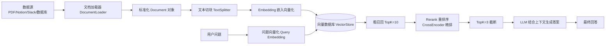
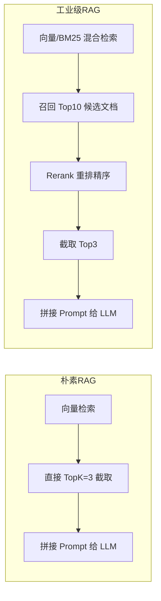
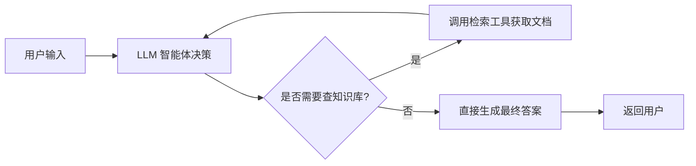
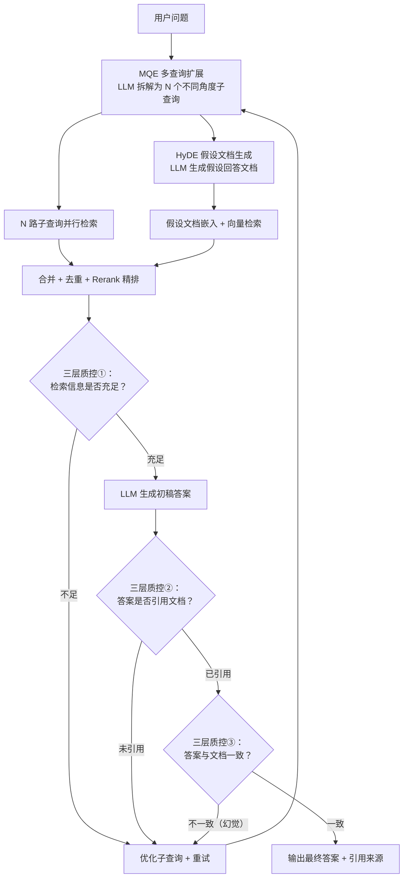

# RAG 全架构知识点重构 + 完整可运行代码

整体分为**基础知识库构建、流水线式 RAG（含 Rerank）、Agentic RAG、混合 Self-RAG（MQE + HyDE + 三层质控）**四大模块，知识点精炼 + Mermaid 流程图 + Python 可运行代码（LangChain 新版语法），适配学习与工程落地。

## 一、基础：知识库构建核心知识点

### 1.1 核心定义

知识库 = 原始非结构化/结构化数据 → 向量化可检索存储载体，是所有 RAG 的底层底座。

如果已有业务库（SQL、CRM、企业网盘），无需重新构建向量库，直接封装为 **Tool 工具** 接入 Agent 即可。

### 1.2 检索流水线模块化链路（完整链路）



### 1.3 五大核心组件说明

| 组件 | 作用 | 常用实现 |
| ---- | ---- | ---- |
| 文档加载器 | 统一读取多源文件，输出 LangChain 标准 Document | PyPDFLoader、TextLoader、WebBaseLoader |
| 文本切分器 | 长文档拆分小块，适配 LLM 上下文窗口，重叠避免断语义 | RecursiveCharacterTextSplitter |
| 嵌入模型 | 文本→高维向量，语义相近向量距离更近 | OpenAIEmbeddings、Ollama 本地嵌入、BGE |
| 向量存储 | 向量持久化 + 相似度检索 | Chroma（本地测试）、FAISS、Milvus、Pinecone |
| 检索器 | 对外统一检索接口，屏蔽向量库细节 | VectorStoreRetriever、父文档检索器、BM25 混合检索 |

### 1.4 粗排 vs 精排

| 阶段 | 方式 | 模型 | 速度 | 精度 |
|------|------|------|------|------|
| 粗排（召回） | 向量余弦相似度 | Embedding 模型（Bi-Encoder） | 快 | 粗 |
| 精排（Rerank） | 问题+文档成对打分 | Cross-Encoder（BGE-Rerank 等） | 慢 | 高 |

最佳实践：**粗召回 Top10~20 + Rerank 精排 + Top3~5 截断**，兼顾速度与精度。

### 1.5 知识库构建基础代码（公共底座，后续 RAG 全部复用）

#### 依赖安装

```bash
pip install langchain langchain-chroma langchain-openai python-dotenv
```

#### 知识库初始化代码

```python
from dotenv import load_dotenv
from langchain_core.documents import Document
from langchain.text_splitter import RecursiveCharacterTextSplitter
from langchain_openai import OpenAIEmbeddings, ChatOpenAI
from langchain_chroma import Chroma

# 1. 环境变量加载
load_dotenv()

# 2. 模拟业务知识库文档（正式场景用 PyPDFLoader / 网页加载器替换）
raw_docs = [
    Document(page_content="产品A续航7天，IP68防水，售价299元", metadata={"source": "产品手册"}),
    Document(page_content="售后规则：7天无理由退货，30天质量问题换新，客服400-123456", metadata={"source": "售后政策"}),
    Document(page_content="充电规格：5V2A快充，充满耗时1.5小时", metadata={"source": "参数说明"})
]

# 3. 文本切块
text_splitter = RecursiveCharacterTextSplitter(
    chunk_size=200,
    chunk_overlap=30,  # 块重叠，防止上下文断裂
    separators=["\n\n", "\n", "，", "。"]
)
chunk_docs = text_splitter.split_documents(raw_docs)

# 4. 初始化嵌入模型 & 向量库
embedding = OpenAIEmbeddings(model="text-embedding-ada-002")
vector_store = Chroma.from_documents(
    documents=chunk_docs,
    embedding=embedding,
    persist_directory="./chroma_knowledge_db"  # 向量持久化到本地文件夹
)
# 生成检索器（全局复用）
retriever = vector_store.as_retriever(search_kwargs={"k": 3})  # 取 Top3 相似文档

# 基础 LLM 初始化
llm = ChatOpenAI(model="gpt-3.5-turbo", temperature=0)  # temperature=0 禁止幻觉
```

---

## 二、流水线式 RAG（含 Rerank 重排序 + TopK 筛选）

### 2.1 完整检索链路（工业级标准）

向量检索只是粗排，完整链路必须加上 **Rerank 精排** 和 **TopK 截断**：

```
原始多路检索结果 → 候选文档重排（Rerank） → Top-K 文档片段截断 → 送入 LLM
```

### 2.2 为什么向量检索直接 TopK 不够？

向量相似度是粗粒度语义匹配，存在三个典型问题：

1. **语义漂移**：向量分数高，但内容和用户问题无关；
2. **有效文档被挤到后面**：真正有用的答案排名靠后；
3. **混合检索（向量 + BM25）两路结果顺序混乱**。

### 2.3 Rerank 重排序原理

用 **Cross-Encoder 交叉编码器模型**（BGE-Rerank、Cohere Rerank、Jina Rerank），把「用户问题 + 单条文档」成对输入模型，模型直接输出精准相关性分数，重新对全部候选文档从高到低排序。

一句话：**粗筛之后做精排，修正向量检索的排序错误，把真正有用的文档顶到前排。**

### 2.4 流程对比



### 2.5 核心执行逻辑

**先一次性检索全部上下文 → Rerank 重排 → TopK 截断 → 再调用 LLM 生成答案**，串行阶段，无循环、无二次检索。

优势：链路简单、延迟稳定可控、成本低（LLM 仅调用 1 次）、易于调试，适合 FAQ、固定文档问答、客服机器人。

劣势：无法处理复杂多轮拆解问题、模糊问句、需要多轮补全信息的场景。

### 2.6 完整可运行代码（含 Rerank 重排序）

```python
from langchain_core.prompts import ChatPromptTemplate
from langchain_core.runnables import RunnablePassthrough
from langchain_core.output_parsers import StrOutputParser
from langchain.retrievers import ContextualCompressionRetriever
from langchain.retrievers.document_compressors import CrossEncoderReranker

# 1. 基础检索器：先粗召回 10 条候选文档
base_retriever = vector_store.as_retriever(search_kwargs={"k": 10})

# 2. 候选文档重排（CrossEncoder 精排序 + TopK 筛选一步完成）
compressor = CrossEncoderReranker(
    model_name="BAAI/bge-reranker-v2-m3",
    top_n=3  # 重排后直接截取 Top3
)
rerank_retriever = ContextualCompressionRetriever(
    base_retriever=base_retriever,
    base_compressor=compressor
)

# 3. Prompt 模板
rag_prompt = ChatPromptTemplate.from_messages([
    ("system", "你是产品售后问答助手，严格依据参考文档回答。文档无相关信息直接回复「知识库无该内容」，禁止编造信息。\n参考文档：{context}"),
    ("human", "用户问题：{question}")
])

# 4. 工具函数：格式化检索文档
def format_retrieve_docs(docs):
    return "\n=====文档片段=====\n".join([doc.page_content for doc in docs])

# 5. 构建 RAG 链路（粗召回 → Rerank → TopK → LLM）
two_step_rag_chain = (
    {
        "context": rerank_retriever | format_retrieve_docs,
        "question": RunnablePassthrough()
    }
    | rag_prompt
    | llm
    | StrOutputParser()
)

# 调用测试
if __name__ == "__main__":
    res = two_step_rag_chain.invoke("产品A售后换货期限是多久？")
    print(res)
    # 测试知识库不存在内容
    res2 = two_step_rag_chain.invoke("产品A配件价格")
    print(res2)
```

### 2.7 Rerank 为什么不能省？

- 朴素 RAG 直接向量 Top3，容易拿到看似相似、实则无用的文本，误导大模型；
- Rerank 之后文档相关性大幅提升，是**提升 RAG 回答准确率最具性价比的优化手段**；
- TopK 截断同时控制总文本 Token 长度，防止超长上下文超出 LLM 窗口限制，降低输入成本。

---

## 三、Agentic RAG（智能体式 RAG）

### 3.1 核心知识点

1. **核心逻辑**：LLM 作为 Agent 决策中枢，**自主判断是否需要检索、检索几次、切换不同工具（知识库/网页/数据库）**，按需调用检索工具，可多轮工具调用。
2. 优势：极强灵活性，适配复杂开放式问题、多数据源融合、长链路推理（如产品调研、技术文档深度答疑）。
3. 劣势：LLM 调用次数不固定、延迟波动大、成本更高、需要做工具调用约束防无效调用。
4. 实现形式：将向量检索封装为 LangChain Tool，Agent 自主决定触发工具。



### 3.2 完整可运行代码（检索工具 + Agent 执行器）

```python
from langchain.tools import tool
from langchain.agents import create_tool_calling_agent, AgentExecutor
from langchain_core.prompts import ChatPromptTemplate

# 1. 将向量检索封装为 Agent 可用工具
@tool
def knowledge_search(query: str) -> str:
    """
    产品知识库检索工具，当需要查询产品参数、售后政策、充电规格时调用此工具
    :param query: 用户需要查询的关键词、问题
    :return: 知识库匹配的文档内容
    """
    docs = retriever.get_relevant_documents(query)
    return "\n".join([f"文档内容：{doc.page_content}" for doc in docs])

# 2. 定义 Agent 系统提示词
agent_prompt = ChatPromptTemplate.from_messages([
    ("system", "你是产品智能顾问，遇到产品参数、售后问题必须调用 knowledge_search 工具查询知识库，禁止凭记忆回答。多次检索可以合并信息再作答。"),
    ("human", "{input}"),
    ("placeholder", "{agent_scratchpad}")
])

# 3. 创建工具调用 Agent
tools = [knowledge_search]
agent = create_tool_calling_agent(llm, tools, agent_prompt)
agent_executor = AgentExecutor(agent=agent, tools=tools, verbose=True, max_iterations=3)

# 4. 调用测试
if __name__ == "__main__":
    result = agent_executor.invoke({"input": "产品A充满电要多久，售后换新是多久？"})
    print("最终回答：", result["output"])
```

### 3.3 扩展：网页文档 Agentic RAG（原文案例落地）

基于 URL 文档动态抓取的 Agent，适配在线文档站点检索：

```python
import requests
from markdownify import markdownify as md

@tool
def fetch_docs_url(url: str) -> str:
    """拉取 LangGraph 官方文档网页内容，仅允许 langchain-ai.github.io 域名"""
    allow_domain = "https://langchain-ai.github.io/"
    if not url.startswith(allow_domain):
        return "非法域名，仅可查询官方文档地址"
    resp = requests.get(url, timeout=10)
    return md(resp.text)

# 加载 llms.txt 目录文档
llms_txt = requests.get("https://langchain-ai.github.io/langgraph/llms.txt").text
sys_prompt = f"""
你是 LangGraph 技术专家，回答 API、使用配置问题必须调用 fetch_docs_url 查阅官方文档。
文档目录参考：
{llms_txt}
引用文档片段作答，文档拉取失败使用自身知识作答。
"""
web_agent = create_tool_calling_agent(llm, [fetch_docs_url], ChatPromptTemplate.from_messages([
    ("system", sys_prompt), ("human", "{input}"), ("placeholder", "{agent_scratchpad}")
]))
web_agent_exec = AgentExecutor(agent=web_agent, tools=[fetch_docs_url], verbose=True)
# 调用
# web_agent_exec.invoke({"input": "写一个基于 create_react_agent 获取股价的 LangGraph 示例"})
```

---

## 四、混合 RAG（Hybrid Self-RAG + MQE + HyDE）

### 4.1 架构定位

融合三大检索增强技术 + 三层质控闭环，是当前工业级 RAG 的最高精度方案：

| 技术 | 全称 | 做什么 | 解决什么痛点 |
|------|------|--------|-------------|
| **MQE** | Multi-Query Expansion 多查询扩展 | 将用户问题改写为多个不同角度的子查询，并行检索后合并去重 | 单一查询角度遗漏关键文档 |
| **HyDE** | Hypothetical Document Embeddings 假设文档嵌入 | LLM 先生成一份"假设回答"，再用这份回答做向量检索 | 短问题与长文档之间的语义鸿沟 |
| **三层质控** | Quality Control Loop | 检索校验 → 答案生成 → 真实性校验，不合格回退重试 | 幻觉、检索不足、答案偏离原文 |

### 4.2 MQE 多查询扩展原理

单次查询的局限性：用户问"这产品怎么样"，向量检索只能抓到"产品"相关文档，可能遗漏"售后""配件""评测"等维度的内容。

MQE 做法：LLM 把原始问题拆成 N 个不同角度的查询，每个查询独立检索，结果合并 + Rerank 去重排序：

```
用户："这产品怎么样"
↓ LLM 拆解
├─ 查询1："产品规格参数续航防水"  → 召回 [文档A, B]
├─ 查询2："产品售后政策退换货"    → 召回 [文档C]
└─ 查询3："产品用户评价优缺点"    → 召回 [文档D, E]
↓ 合并去重 + Rerank
最终候选：[A, C, D, B, E] 按相关性精排 → TopK
```

### 4.3 HyDE 假设文档嵌入原理

向量检索的核心矛盾：**用户问题短（几个词），知识库文档长（几百字）**，两者的向量在语义空间里距离天然远。

HyDE 的解法：先用 LLM 生成一份"假设答案文档"，不管内容真假，关键是**篇幅和风格接近真实文档**，再用这份长文本去做向量检索，匹配度大幅提升。

```
用户问题："充电要多久"
     ↓ 传统方式：短 query 直接嵌入 → 向量 [0.1, -0.3, ...] → 和长文档向量距离远
     ↓ HyDE 方式：
LLM 生成假设文档："本产品使用 5V2A 充电器，内置 5000mAh 电池，
                        充满电大约需要 1.5 小时..."  ← 长度/风格接近真实文档
     ↓ 嵌入这份假设文档 → 向量 [0.08, -0.28, ...] → 和真实文档向量距离近
     ↓ 检索命中："充电规格：5V2A快充，充满耗时1.5小时" ✓
```

### 4.4 完整架构流程



### 4.5 完整可运行代码（LangGraph 实现）

```python
from langgraph.graph import StateGraph, END
from typing import TypedDict, List
from langchain.retrievers import ContextualCompressionRetriever
from langchain.retrievers.document_compressors import CrossEncoderReranker
import itertools

# ============================================================
# 1. 定义状态结构体
# ============================================================
class HybridRAGState(TypedDict):
    question: str              # 原始问题
    sub_queries: List[str]     # MQE 拆解的子查询列表
    hypo_doc: str              # HyDE 生成的假设文档
    context: str               # 合并检索后的文档上下文
    answer: str                # 最终答案
    sources: List[str]         # 引用来源
    retry_count: int           # 重试次数

# ============================================================
# 2. MQE 节点：多查询扩展
# ============================================================
def mqe_expand(state: HybridRAGState) -> HybridRAGState:
    """将用户问题拆解为多个角度子查询"""
    prompt = f"""把用户问题从不同角度拆解为 3 个检索子查询，覆盖不同维度和关键词。
只输出子查询列表，一行一个，不要编号。

用户问题：{state['question']}

示例：
问题：这个笔记本适合程序员吗？
输出：
程序员笔记本性能配置要求 CPU内存
轻薄本编程开发体验散热续航
笔记本Linux驱动兼容性程序员"""
    result = llm.invoke(prompt).content.strip()
    sub_queries = [q.strip() for q in result.split("\n") if q.strip()]
    return {
        "sub_queries": sub_queries,
        "retry_count": state.get("retry_count", 0)
    }

# ============================================================
# 3. HyDE 节点：生成假设文档
# ============================================================
def hyde_generate(state: HybridRAGState) -> HybridRAGState:
    """生成假设回答文档，用于缩小 短query/长doc 的语义鸿沟"""
    prompt = f"""针对用户问题，写一段假设性回答文档。内容可以编造（后续会用真实文档验证），
关键是篇幅和风格要接近知识库中的真实文档（100-300字，陈述句，包含具体参数/规则）。

用户问题：{state['question']}

只输出假设文档内容："""
    hypo_doc = llm.invoke(prompt).content.strip()
    return {"hypo_doc": hypo_doc}

# ============================================================
# 4. 多路检索 + 合并 + Rerank 节点
# ============================================================
def multi_retrieve(state: HybridRAGState) -> HybridRAGState:
    """MQE 子查询并行检索 + HyDE 检索 → 合并去重 → Rerank 精排"""
    
    # 准备 Reranker
    compressor = CrossEncoderReranker(
        model_name="BAAI/bge-reranker-v2-m3",
        top_n=5
    )
    rerank_retriever = ContextualCompressionRetriever(
        base_retriever=vector_store.as_retriever(search_kwargs={"k": 5}),
        base_compressor=compressor
    )
    
    # 收集所有检索结果
    all_docs = []
    seen = set()
    
    # MQE 多路子查询检索
    for q in state["sub_queries"]:
        docs = vector_store.similarity_search(q, k=5)
        for doc in docs:
            key = doc.page_content[:100]  # 去重标记
            if key not in seen:
                seen.add(key)
                all_docs.append(doc)
    
    # HyDE 假设文档检索
    hyde_docs = vector_store.similarity_search(state["hypo_doc"], k=5)
    for doc in hyde_docs:
        key = doc.page_content[:100]
        if key not in seen:
            seen.add(key)
            all_docs.append(doc)
    
    # Rerank 精排（以原始问题为 query，对所有候选文档重新打分排序）
    # 这里用 prompt 驱动 LLM 做简易 Rerank，生产环境可换成 CrossEncoderReranker
    if len(all_docs) > 5:
        docs_text = "\n---\n".join([f"[{i}] {d.page_content}" for i, d in enumerate(all_docs)])
        prompt = f"""从以下候选文档中，选出和用户问题最相关的 5 条，只输出编号（逗号分隔）。

用户问题：{state['question']}

{docs_text}

最相关 5 条编号："""
        top_ids = llm.invoke(prompt).content.strip()
        try:
            ids = [int(x.strip()) for x in top_ids.split(",") if x.strip().isdigit()]
            all_docs = [all_docs[i] for i in ids if i < len(all_docs)]
        except:
            all_docs = all_docs[:5]  # fallback
    
    context_text = "\n=====文档片段=====\n".join(
        [f"[来源：{d.metadata.get('source', 'unknown')}]\n{d.page_content}" for d in all_docs]
    )
    
    return {
        "context": context_text,
        "sources": [d.metadata.get("source", "unknown") for d in all_docs]
    }

# ============================================================
# 5. 三层质控节点
# ============================================================

# 质控①：检索充足性判断
def qc_retrieval_check(state: HybridRAGState) -> str:
    """判断检索结果是否足够回答用户问题"""
    if state.get("retry_count", 0) >= 3:
        return "generate_answer"  # 防止死循环
    
    prompt = f"""判断以下文档是否包含回答用户问题所需的信息。
仅输出「足够」或「不足」。

用户问题：{state['question']}

检索文档：
{state['context'][:3000]}"""
    result = llm.invoke(prompt).content.strip()
    if "不足" in result:
        return "retry"
    return "generate_answer"

# 质控②：答案引用校验
def qc_citation_check(state: HybridRAGState) -> str:
    """判断答案是否引用了检索文档"""
    prompt = f"""判断以下回答是否引用了文档内容来支撑观点。
仅输出「已引用」或「未引用」。

回答：{state['answer']}

文档：{state['context'][:2000]}"""
    result = llm.invoke(prompt).content.strip()
    if "未引用" in result:
        return "retry"
    return "factuality_check"

# 质控③：答案真实性校验（防幻觉）
def qc_factuality_check(state: HybridRAGState) -> str:
    """判断答案是否有编造（幻觉）"""
    prompt = f"""逐条核验以下回答中的事实是否都能在文档中找到依据。
如果存在编造、数据错误的，输出「不一致」；全部有据可查则输出「一致」。

回答：{state['answer']}

参考文档：{state['context'][:3000]}

仅输出「一致」或「不一致」："""
    result = llm.invoke(prompt).content.strip()
    if "不一致" in result:
        return "retry"
    return "end"

# ============================================================
# 6. 生成答案 & 重试节点
# ============================================================
def generate_answer(state: HybridRAGState) -> HybridRAGState:
    prompt = ChatPromptTemplate.from_messages([
        ("system", """你是严谨的知识库问答助手。严格依据文档回答，每个事实都要标注来源。
文档无相关信息直接回复「知识库无该内容」，禁止编造。

参考文档：{context}"""),
        ("human", "{question}")
    ])
    answer = llm.invoke(prompt.format(
        context=state["context"], question=state["question"]
    )).content
    return {"answer": answer}

def retry_handler(state: HybridRAGState) -> HybridRAGState:
    """重试：增加重试计数，重新扩写查询"""
    return {"retry_count": state.get("retry_count", 0) + 1}

# ============================================================
# 7. 组装 LangGraph 工作流
# ============================================================
builder = StateGraph(HybridRAGState)

# 添加节点
builder.add_node("mqe_expand", mqe_expand)
builder.add_node("hyde_generate", hyde_generate)
builder.add_node("multi_retrieve", multi_retrieve)
builder.add_node("generate_answer", generate_answer)
builder.add_node("retry_handler", retry_handler)

# 流转逻辑
builder.set_entry_point("mqe_expand")
builder.add_edge("mqe_expand", "hyde_generate")
builder.add_edge("hyde_generate", "multi_retrieve")

# 质控①：检索充足性 → 分支
builder.add_conditional_edges(
    "multi_retrieve", qc_retrieval_check,
    {"generate_answer": "generate_answer", "retry": "retry_handler"}
)

# 质控②：引用校验 → 分支
builder.add_conditional_edges(
    "generate_answer", qc_citation_check,
    {"factuality_check": "retry_handler", "retry": "retry_handler"}
)

# 重试回路：回到 MQE 重新扩写（带新关键词）
builder.add_edge("retry_handler", "mqe_expand")

# 质控③这一步在代码中内联到 qc_citation_check 的分支里
# 完整实现可以拆成独立节点，这里为简洁合并

builder.add_conditional_edges(
    "generate_answer", qc_factuality_check,
    {"retry": "retry_handler", "end": END}
)

# 编译
hybrid_self_rag = builder.compile()

# ============================================================
# 8. 测试调用
# ============================================================
if __name__ == "__main__":
    result = hybrid_self_rag.invoke({
        "question": "产品A充电要多久，售后怎么换新？",
        "retry_count": 0
    })
    print("最终答案：", result["answer"])
    print("引用来源：", result.get("sources", []))
    print("重试次数：", result.get("retry_count", 0))
```

### 4.6 各技术组件贡献拆解

| 组件 | 延迟代价 | 成本代价 | 召回提升 | 抑制幻觉 |
|------|---------|---------|---------|---------|
| MQE 多查询扩展 | 中（N 路并行检索） | 低（仅检索无 LLM 调用） | 高（多角度覆盖） | 无直接帮助 |
| HyDE 假设文档 | 中（1 次 LLM + 1 次检索） | 中（生成假设文档） | 高（弥合语义鸿沟） | 无直接帮助 |
| Rerank 精排 | 低（CrossEncoder 推理） | 低（本地模型） | 高（修正粗排） | 无直接帮助 |
| 三层质控闭环 | 中（3 次 LLM 校验） | 中（3 次额外调用） | 无直接帮助 | 高（兜底防幻觉） |

### 4.7 适用场景与取舍

- **适用**：金融合规审查、医疗文献问答、法律条文检索、企业内部高精度知识库
- **不适用**：实时客服（延迟不可接受）、个人笔记搜索（过度设计）
- **成本优化建议**：MQE + HyDE 二选一先上，三层质控保留检索+真实性两层即可，引用校验可合并

---

## 五、五种 RAG 架构横向对比

| 架构 | 检索链路 | 控制力度 | 灵活度 | 延迟 | 准确率 | 适用场景 |
| ---- | ---- | ---- | ---- | ---- | ---- | ---- |
| 朴素 RAG | 向量 → TopK | 高 | 低 | 低 | 低 | 个人项目、Demo 验证 |
| 流水线式 RAG（含 Rerank） | 粗召回 → Rerank → TopK | 高 | 低 | 低 | 中 | FAQ、客服、固定文档问答 |
| Agentic RAG | Agent 自主决策 + 多工具 | 低 | 极高 | 波动大 | 中高 | 复杂咨询、多工具融合、技术调研 |
| 混合 Self-RAG（旧版） | 查询增强 + 检索/答案校验闭环 | 中 | 中 | 中 | 中高 | 一般精度要求的企业问答 |
| 混合 Self-RAG（MQE + HyDE） | MQE 多路 + HyDE + Rerank + 三层质控 | 中 | 中 | 高 | 极高 | 金融/医疗/法律等高精度场景 |

---

## 六、工程落地选型建议

1. **Demo/个人项目**：朴素 RAG，最快跑通；
2. **生产级 FAQ/客服**：**流水线式 RAG + Rerank**，成本低延迟稳；
3. **复杂多数据源问答**：**Agentic RAG**，灵活调度多工具；
4. **一般高精度业务**：**旧版 Self-RAG**（查询增强 + 检索/答案校验），成本可控；
5. **金融/医疗/法律**：**MQE + HyDE + 三层质控 Self-RAG**，检索覆盖率 + 防幻觉双保险；
6. **降本取舍**：MQE 和 HyDE 二选一先上，三层质控保留检索+真实性校验即可，引用校验可合并省成本。
